

# 进程
## 进程状态

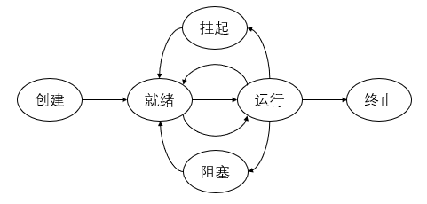

## 进程控制块PCB

<table border = "true" align = "center">
    <tr>
        <td>进程状态</td>
    </tr>
    <tr>
        <td>进程编号</td>
    </tr>
    <tr>
        <td>程序计数器</td>
    </tr>
    <tr>
        <td>寄存器</td>
    </tr>
    <tr>
        <td>内存界限</td>
    </tr>
    <tr>
        <td>打开文件列表</td>
    </tr>
    <tr>
        <td>...</td>
    </tr>
</table>

<ul>
<li>进程状态:状态包括new,ready,running,waiting,terminated等
<li>程序计数器:计数器表示进程要执行的下个指令地址
<li>CPU寄存器:
<li>CPU调度信息:进程优先级、调度队列的指针和其他调度参数
<li>内存管理信息:根据操作系统所使用的的内存系统，包括基址和界限寄存器的值、页表和段表
</ul>

## 进程生成

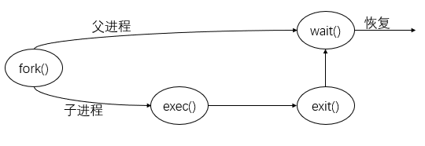

子进程，系统调用fork()的返回值为0，而对于父进程，返回值为子进程的标识符

### 僵尸进程和孤儿进程
<ul>
<li>一般情况下，子进程是由父进程创建，而子进程和父进程的退出是无顺序的，两者之间都不知道谁先退出。正常情况下父进程先结束会调用 wait 或者 waitpid 函数等待子进程完成再退出，而一旦父进程不等待直接退出，则剩下的子进程会被init(pid=1)进程接收，成会孤儿进程。（进程树中除了init都会有父进程）。
<li>如果子进程先退出了，父进程还未结束并且没有调用 wait 或者 waitpid 函数获取子进程的状态信息，则子进程残留的状态信息（ task_struct 结构和少量资源信息）会变成僵尸进程。
子进程退出时向父进程发送SIGCHILD信号，父进程处理SIGCHILD信号。在信号处理函数中调用wait进行处理僵尸进程。 
原理是将子进程成为孤儿进程，从而其的父进程变为init进程，通过init进程可以处理僵尸进程。
</ul>

### 守护进程是什么？怎么实现？
>守护进程（Daemon）是运行在后台的一种特殊进程。它独立于控制终端并且周期性地执行某种任务或等待处理某些发生的事件。守护进程是一种很有用的进程。

#### 守护进程特点
<ul>
<li>守护进程最重要的特性是后台运行。
<li>守护进程必须与其运行前的环境隔离开来。这些环境包括未关闭的文件描述符，控制终端，会话和进程组，工作目录以及文件创建掩模等。这些环境通常是守护进程从执行它的父进程（特别是shell）中继承下来的。 
<li>守护进程的启动方式有其特殊之处。它可以在Linux系统启动时从启动脚本/etc/rc.d中启动，可以由作业规划进程crond启动，还可以由用户终端（shell）执行。
</ul>

#### 实现
<ol>
<li>在父进程中执行fork并exit推出；
<li>在子进程中调用setsid函数创建新的会话；
<li>在子进程中调用chdir函数，让根目录 ”/” 成为子进程的工作目录；
<li>在子进程中调用umask函数，设置进程的umask为0；
<li>在子进程中关闭任何不需要的文件描述符
</ol>

## 进程通信
<ul>
<li>如果一个进程不能影响其他进程或被其他进程所影响，那么该进程是独立的
<li>如果一个进程能影响其他进程或被其他进程所影响，那么该进程是协作的
</ul>

协作进程需要一种进程间通信机制（interprocess communication，IPC）
### 进程间通信的基本模式
<ul>
<li>共享内存
<li>消息传递
</ul>

### 共享内存系统
>建立共享内存区域
#### 生产者-消费者问题

### 消息传递系统
<ul>
<li>直接或间接通信 
<ul>
<li>直接通信</li>
需要通信的每个进程必须明确地命名通信的接收者和发送者
<ul>
<li>send(P,message):发送消息到进程P
<li>receive(Q,message):接收来自进程Q的消息
</ul>
属性
<ul>
<li>在需要通信的每对进程之间自动建立线路
<li>一条线路只能与两个进程相关联
<li>每队进程之间只有一条线路
</ul>

缺点：限制进程定义的模块化，不利于维护（硬编码）
<li>间接通信</li>
通过邮箱或端口来发送接收消息
<ul>
<li>send(A,message):发送消息到邮箱A
<li>receive(A,message):接收来自邮箱A的消息
</ul>
属性
<ul>
<li>只有在两个进程共享一个邮箱时，才能建立通信线路
<li>一条线路可以与两个或更多的进程相关联
<li>两个通信进程之间可有多个不同的线路，每个线路对应一个邮箱
</ul>
</ul>
<li>同步或异步通信
<li>自动或显式缓冲
</ul>

### IPC系统实例

#### POSIX共享内存
<ol>
    <li>调用共享内存:</li>
    segment_id = shmget(IPC_PRIVATE,size,S_IRUSR|S_IWUSR) 
    第一个参数：共享内存关键字（标识符）。IPC_PRIVATE生成一个新的共享内存段 
    第二个参数：共享内存段的大小 
    第三个参数：模式是读或写 
    <li>访问共享内存:</li>
    shared_memory = (char*)shmat(id,NULL,0) 
    sprintf(shared_memory,"Write to shared memory") 
    第一个参数：共享内存关键字（标识符） 
    第二个参数：内存中的指针位置。NULL，系统为用户选择位置 
    第三个参数：模式是读或写 
    <li>分离共享内存:</li>
    shmdt(shared_memory) 
    <li>删除共享内存:</li>
    shmctl(segment_id,IPC_RMID,NULL) 
</ol>

#### Mach
#### Windos

### 客户机-服务器系统通信

#### Socket
#### RPC
#### RMI

## 线程

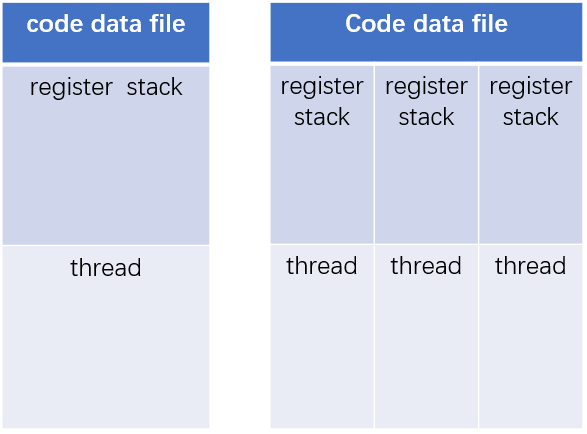

### 优点
<ul>
    <li>响应度高
    <li>资源共享
    <li>节省资源
    <li>多处理器体系结构的利用
</ul>

### 模型
<ul>
<li>多对一模型
<li>一对一模型
<li>多对多模型
</ul>

### 设计一个线程池，内存池
<ul>
<li>为什么需要线程池</li>

大多数的网络服务器，包括Web服务器都具有一个特点，就是单位时间内必须处理数目巨大的连接请求，但是处理时间却是比较短的。在传统的多线程服务器模型中是这样实现的：一旦有个请求到达，就创建一个新的线程，由该线程执行任务，任务执行完毕之后，线程就退出。这就是”即时创建，即时销毁”的策略。尽管与创建进程相比，创建线程的时间已经大大的缩短，但是如果提交给线程的任务是执行时间较短，而且执行次数非常频繁，那么服务器就将处于一个不停的创建线程和销毁线程的状态。这笔开销是不可忽略的，尤其是线程执行的时间非常非常短的情况。
<li>线程池原理</li>
在应用程序启动之后，就马上创建一定数量的线程，放入空闲的队列中。这些线程都是处于阻塞状态，这些线程只占一点内存，不占用CPU。当任务到来后，线程池将选择一个空闲的线程，将任务传入此线程中运行。当所有的线程都处在处理任务的时候，线程池将自动创建一定的数量的新线程，用于处理更多的任务。执行任务完成之后线程并不退出，而是继续在线程池中等待下一次任务。当大部分线程处于阻塞状态时，线程池将自动销毁一部分的线程，回收系统资源。
<li>线程池的作用</li>
需要大量的线程来完成任务，且完成任务的时间比较短；对性能要求苛刻的应用；对性能要求苛刻的应用
<li>内存池的原理</li>
在软件开发中，有些对象使用非常频繁，那么我们可以预先在堆中实例化一些对象，我们把维护这些对象的结构叫“内存池”。在需要用的时候，直接从内存池中拿，而不用从新实例化，在要销毁的时候，不是直接free/delete，而是返还给内存池。把那些常用的对象存在内存池中，就不用频繁的分配/回收内存，可以相对减少内存碎片，更重要的是实例化这样的对象更快，回收也更快。当内存池中的对象不够用的时候就扩容。可以避免频繁内核和用户态交换数据
<li>内存池的优缺点</li>
内存池对象不是线程安全的，在多线程编程中，创建一个对象时必须加锁。

## CPU调度

### 调度准则
<ul>
<li>CPU使用率
<li>吞吐量
<li>周转时间
<li>等待时间
<li>响应时间
</ul>

### 调度算法
<ul>
<li>先来先服务
<li>最短作业优先
<li>优先级调度
<li>时间片轮转
<li>多级队列
</ul>

## 进程同步

### 临界区
>对共享内存进行访问的代码片段
#### 条件
<ul>
<li>互斥</li>
实现互斥的方式
<ul>
<li>屏蔽中断
<li>加锁
</ul>
Peterson算法
TSL指令
SCHG指令
<li>前进
<li>有限等待
</ul>

### 信号量
>wait() signal() (P/V)

<ul>
<li>计数
<li>二进制0/1 mutex
</ul>

### 管程
>类型或抽象数据类型，封装了私有数据类型及操作数据的公有方法 
确保一次只有一个进程在管程内活动

## 死锁
### 必要条件
<ul>
<li>互斥
<li>循环等待
<li>忙则等待
<li>不可抢占
</ul>

### 死锁预防
破坏四个必要条件

### 从死锁中恢复

<li>通过抢占进行恢复</li>
在某些情况下，可能会临时将某个资源从它的持有者转移到另一个进程。比如在不通知原进程的情况下，将某个资源从进程中强制取走给其他进程使用，使用完后又送回。这种恢复方式一般比较困难而且有些简单粗暴，并不可取。

<li>通过回滚进行恢复</li>
如果系统设计者和机器操作员知道有可能发生死锁，那么就可以定期检查流程。进程的检测点意味着进程的状态可以被写入到文件以便后面进行恢复。检测点不仅包含存储映像(memory image)，还包含资源状态(resource state)。一种更有效的解决方式是不要覆盖原有的检测点，而是每出现一个检测点都要把它写入到文件中，这样当进程执行时，就会有一系列的检查点文件被累积起来。

为了进行恢复，要从上一个较早的检查点上开始，这样所需要资源的进程会回滚到上一个时间点，在这个时间点上，死锁进程还没有获取所需要的资源，可以在此时对其进行资源分配。

<li>杀死进程恢复</li>
最简单有效的解决方案是直接杀死一个死锁进程。但是杀死一个进程可能照样行不通，这时候就需要杀死别的资源进行恢复。

另外一种方式是选择一个环外的进程作为牺牲品来释放进程资源。

### 死锁避免
#### 安全状态
>如果OS能按某个顺序为每个进程分配资源并能避免死锁，那么OS状态就是安全的

安全状态不是死锁状态，死锁状态是不安全状态

#### 银行家算法
<ol>
<li>如果Request<=Need,转到2；否则出错</li>
<li>如果Request<=Available,转到3；否则等待</li>
<li>分配资源</li>
Available = Available - Request 
Allocation = Allocation + Request 
Need = Need - Request 
</ol>

## 内存管理
>CPU能访问的存储器只有内存和处理器内的寄存器

>内存空间保护是通过CPU硬件对用户模式所产生的的每一个地址与寄存器的地址进行比较来完成的 只有操作系统可以通过特殊指令来加载基址寄存器和界限地址寄存器

### 交换
>进程需要在内存中以便执行。进程也可以暂时从内存中交换到备份存储上，当执行时再调回

>这种交换策略的变种被用在基于优先级的调度算法中。交换有时称为roll out/roll in
- 备份存储通常为足够大的快速磁盘，以容纳所有用户程序的内存镜像副本、并提供对内存镜像的直接访问。交换系统上下文切换时间较长，为有效使用 CPU，通常使每个进程每次执行获取的时间片比交换时间长。
- 为了 **只交换用户进程真正使用的内存空间** （如一个用户进程当前可能只使用了 10MB，但其最多可能使用 200 MB），用户进程需要告诉系统其内存需求情况以减少交换时间。
- 换出进程时，进程必须完全处于空闲状态。考虑如下场景：一个正在等待 I/O 操作的进程 P 即将被换出，若 I/O 操作异步访问 P 进程内存中的缓冲区，或是 I/O 设备正忙，I/O 操作在排队等待，此时换出进程 P，换入进程 P’ 会导致 I/O 操作已经属于 P’ 的内存。解决方案：
  - 不能换出有待处理 I/O 的进程
  - I/O 操作只能使用操作系统缓冲区，仅当进程在内存中执行时才发生操作系统缓冲和进程内存缓冲之间的数据转移
- 上述标准交换在目前的操作系统中使用不广泛，交换需要很长时间并且只能提供很少的执行时间。对上述交换方式的一种修正在很多 UNIX 系统中得到使用：当且仅当系统负荷过高，内存吃紧时进行交换。早期缺乏高级硬件的个人计算机通过此种交换可同时运行多个进程，如 MS Windows 3.1，该系统内存不足时将老进程交换到磁盘上，当且仅当用户再次选择执行该进程时才再次换入。

### 逻辑地址和物理地址

- CPU 生成的地址为 **逻辑地址（logical address）** ，加载到 **内存地址寄存器（memory-address register）** 中的地址为 **物理地址（physical address）** 。编译时和加载时的地址绑定方法生成的逻辑地址和物理地址相同，执行时的地址绑定方案生成的逻辑地址和物理地址不同。通常称逻辑地址为 **虚拟地址（virtual address）** 。
- **逻辑地址空间（logical address space）** 为由程序所生成的所有逻辑地址的集合， **物理地址空间（physical address space）** 为与这些逻辑地址对应的物理地址集合。
- 运行时从虚拟地址到物理地址的映射由硬件设备 **内存管理单元（memory-management unit，MMU）** 完成。一个最简单的 MMU 方案是将用户进程产生的地址加上 **重定位寄存器（relocation register）** 的值作为最终的物理内存地址。
- 用户进程绝不会看到真正的物理地址，一个地址在内存中比较、使用均基于虚拟地址，只有该地址作为内存地址，如执行加载/存储时才需要做到物理空间的地址映射。总而言之，用户进程只产生逻辑地址，且认为地址空间从 0 开始，而使用对应内存地址前必须由 MMU 做物理地址映射。

### 动态加载、链接与共享库

- **动态加载（dynamic loading）** ：所有子程序均以可重定位的方式保存在磁盘上，仅主程序装入内存并执行，当且仅当某个子程序被需要时才会装载进内存。此种方法设计程序主要是用户程序开发者的责任。其优势在于不被使用的子程序绝不会加载，若程序中有较多代码用于处理异常，动态加载会特别有效。
- **动态链接库（dynamically linked library）** ：部分操作系统只支持 **静态链接（static linking）** ，即加载程序将操作系统提供的语言库与其他目标模块一起合并到最终的二进制程序镜像中，所有程序均有一份所需系统库的副本；而动态链接将系统库的加载延迟到运行时，用户程序对系统库的引用留有 **存根（stub）** ，存根指用于定位内存驻留库程序的一小段代码。当执行存根时，若所需的系统库已经驻留在内存中，则存根使用已有的系统库，否则将系统库装入内存。最终存根均会将系统库地址替换自身并执行系统库，此时所有使用某个库的进程只需要一个库代码副本。
- 动态链接为库更新带来方便，库版本更新后，引用该库的程序会自动使用新版本而无需重新链接。多个版本的库也可以同时装入内存，程序根据自己所需的版本信息确定使用哪个副本。此类系统也称为 **共享库（shared libraried）** 。
  
### 连续内存分配
#### 内存保护

- 内存分为操作系统驻留区域和用户进程驻留区域，操作系统通常位于低内存（因为中断向量通常位于低内存）。 **连续内存分配（contiguous memory allocation）** 可使内存中每个进程占有连续的内存区域。
- 通过重定位寄存器和界限地址寄存器可实现内存保护，重定位寄存器含有最低 *物理地址* 值，界限地址寄存器含有 *逻辑地址* 的范围值。重定位寄存器机制也允许操作系统动态改变，若某操作系统服务（如某个驱动程序）不常使用，则内存中不必保留其代码和数据，这类代码称为 **暂时（transient）** 操作系统代码，它们根据需要调入/调出，可在程序执行时动态改变操作系统大小。重定位寄存器和界限地址寄存器的硬件支持如下图所示。

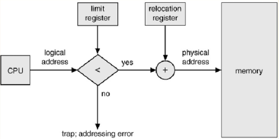

#### 内存分配

- 最简单的内存分配方法：将内存分为多个 **固定** 大小的 **分区（partition）** ，每个分区只能容纳一个进程，多道程序的程度受分区数限制。当一个分区空闲时可以从输入队列选择一个进程调入空闲分区，进程终止时释放该分区。此种方式最初被 MFT（F：Fixed，IBM OS/360）使用，目前已被淘汰。

- 对 MFT 的推广是 MVT（V:Variable），即 **可变分区（variable partition）** 方案。操作系统维护一个表以记录哪些内存可用和哪些内存已被占用。初始时所有内存均可用于用户进程，可视作一大块可用内存，称为 **孔（hole）** 。新进程到来时需要查找足够大的孔，并从该孔为进程分配所需内存，孔内剩余内存可分配给其他进程。随着进程的到来和离开，内存中会分散着大小不同的孔。进程终止时释放的内存会形成新孔，若新孔和其他孔相邻，则这些相邻的孔可以合并为一个大孔。此时系统可以检查是否有进程在等待分配内存空间，以及新合并的内存空间是否满足该进程的需求。

- 上述 MVT 方法是通用动态存储分配问题（dynamic storage allocation problem）
   的一种情况，从内存中的一组孔中选择一个空闲孔有如下三种常用方法，其中执行时间、空间利用方面最差适应方法最差，空间利用方面首次适应和最佳适应相近，但首次适应更快：

  - **首次适应（First fit）** ：分配寻找到的第一个足够大的孔，查找可以从任何位置（如内存开始位置或上次首次适应结束的位置）开始，一旦找到足够大的空闲孔就停止；
  - **最佳适应（Best fit）** ：分配 *最小* 的足够大的孔，此方式必须查找整个表（若表内孔位置记录按孔的大小排序则不需要查找整个表）；
  - **最差适应（Worst fit）** ：分配 *最大* 的孔，同样需要查找整个表，产生的孔比最佳适应方法产生的孔价值更大。

### 碎片

- 首次适应方法和最佳适应方法都有外部碎片问题。随着进程装入和移出内存，空闲内存空间被分为散落的小段，产生 **外部碎片问题（external fragmentation）** ：所有可用内存空间之和满足一个/多个进程的请求，但这些可用内存并不连续。上述首次适应和最佳适应两种不同方法导致的碎片的数量也不同，对于不同的系统两者各有优劣，分配方向（从空闲块的顶端还是模块开始分配内存）也会对碎片数量产生影响。
- **50% 规则** ：对采用首次适应方法的统计表明，假定有 N 个块已被分配，无论采用什么优化，都可能有 0.5N 个块为外部碎片，即 1/3 的内存无法被使用。
- 维护一个小孔的开销比小孔本身可能更大，例如一个需要 2046B 空间的进程被分配了大小为 2048B 的孔，剩余的 2B 小孔维护的开销比 2B 大得多。因此通常采用 *固定大小的块* 而不是字节作为分配单元。此时进程被分配的空间通常大于所需空间，分配给进程的块中使用不到的空间被称为 **内部碎片（internal fragmentation）** 。
- 解决外部碎片问题的方法：
  - **紧缩（compaction）** ：移动内存内容使所有空闲空间合并为一整块。紧缩仅可在重定位是动态的、且在运行时重定位的情况下可用。紧缩根据采用的合并算法不同，需要的开销大小也不同，最简单的合并算法将所有进程移动到内存的一端，空闲的孔移动到内存另一端以生成大孔，其开销较大；
  - 允许一个进程占有的内存地址空间非连续，只要有物理内存就可以为进程分配：分页、分段、分段+分页。

### 分页方法

- 将物理内存分为固定大小的块，称为 **帧（frame）** ，将逻辑内存分配同样大小的块，称为 **页（page）** 。备份存储页分为同样固定大小的块，进程执行时将执行所需的页从备份存储中调入可用的内存帧中。其硬件支持如下图所示。
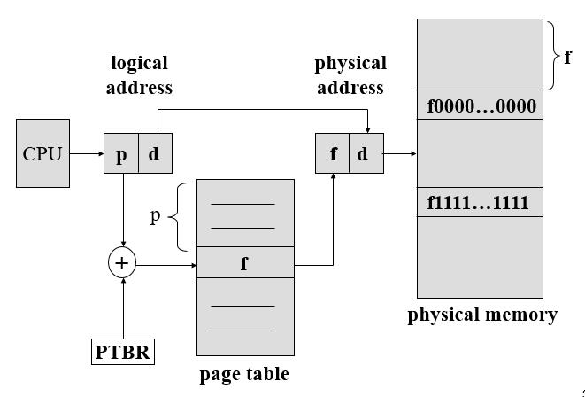
- CPU 生成的每个逻辑地址分为两部分： **页号（page number）** 和 **页偏移（page offset）** ，记为 `p` 和 `d` 。页号为 **页表（page table）** 的索引，页表包含每页位于物理内存的基地址，页 `p` 在页表中对应的基地址加上页偏移量 `d` 即为该逻辑地址映射的物理地址。
- 页大小由硬件决定，通常为 2 的次幂，根据计算机结构不同，每页大小从 512B ~ 16MB 不等。页大小为 2 的幂可直接将逻辑地址的 2 进制表示划分为 `p` 和 `d`。
- 分页也是一种动态重定位，每个逻辑地址由分页硬件绑定为对应的物理地址。采用分页技术不会产生外部碎片，但可能有内部碎片（进程所需内存不足一页，或要求的内存大小不是页的整数倍则最后一帧有内存空闲）。
- 目前页大小通常为 4 ~ 8KB，有的系统支持更大页，有的 CPU 内核支持多种页大小。页的大小受如下因素制约：
  - 在进程大小和页大小无关的前提下，可以假设每个进程平均有半页内部碎片，因此更小的页会带来更少的内部碎片；
  - 页表对于页和物理内存中的帧的对应关系记录需要一定开销，并且该开销随着页大小的增大而减小，页表中每个条目通常占 4B（可变）。
- 分页的重要特点是 *用户视角内存* 和 *实际物理内存* 的分离，通过地址转换硬件将用户视角下的逻辑地址转换为物理地址。用户程序将内存作为一整块处理，而实际物理内存中进程可能分布在各个独立的帧中。用户进程无法访问其页表规定之外的内存，进程可见的页表仅包含进程拥有的页面记录。
- 操作系统使用 **帧表（frame table）** 维护物理内存的分配细节（已被占用的帧、可用帧等），帧表的每个条目对应一帧，并标明该帧是否空闲，若占用则被哪个（些）进程的哪个页占用等。操作系统同时 **为每个进程维护一个页表的副本** ，当一个进程可被分配 CPU 时，CPU 调度程序可根据该副本定义硬件页表（用户进程运行在用户模式，若进行系统调用，操作系统需要使用进程的页表副本来获取进程逻辑地址映射的物理地址）。

### 硬件支持

- 最简单的页表硬件实现方法将页表作为一组专用寄存器。

- 当代计算机允许页表非常大，因此页表放置在内存中，并设置 **页表基寄存器（page-table base register，PTBR）** 指向页表，改变页表的位置仅需要修改此寄存器。此种做法的缺陷在于访问一个字节需要两次内存访问（一次用于在内存的页表中查找页号对应的条目，一次用于获取目标字节）。

- 转换表缓冲区（translation look-aside buffer，TLB） 
  是针对上述问题的专用快速硬件缓冲（关联存储器），其条目由键和值组成。TLB 查找速度快且造价昂贵，通常仅有 64 ~ 1024 个条目。TLB 和页表一起使用时，TLB 仅包含最近使用过的页表条目，查询流程如下：

  - CPU 产生逻辑地址，从逻辑地址提取出页号交付 TLB，TLB 将页号和存储的键比对，若寻找到相同键则结束流程；
  - 请求的页码不在 TLB 中，即 **TLB 失效（TLB miss）** ，此时需要在页表中查询。在页表中查询到与页号对应的帧号后，将页号和帧号增加到 TLB 中。若 TLB 中条目已满，则操作系统使用某种策略替换掉已有的一个条目，例如 *最近最少使用替换（LRU）* 或随机替换等。TLB 中有的条目是永久驻留的（不允许从 TLB 中被替换），通常内核代码在 TLB 中的条目固定。

- 有的 TLB 在每个 TLB 条目中存储了 **地址空间标识符（address-space identifier，ASID）** ，该项用于唯一标识进程，为进程提供地址空间保护。TLB 解析虚拟页号时必须确保当前运行进程的 ASID 和 TLB 中条目对应的 ASID 匹配，否则视作 TLB 失效。除了内存空间保护，ASID 还使 TLB 能够同时包含多个不同进程的记录。如果 TLB 不支持每个条目有独立的 ASID，那么一旦有新页表被选择（例如进程的换入/换出），TLB 就需要被全部 **刷新（flushed）** 或删除，防止 TLB 中存在无效的条目（页号地址无效的条目，如上一个进程留下来的无效物理地址）导致被换入的进程使用错误的地址转换。

- 页号在 TLB 中被查找到的百分比为 **命中率（hit ratio）** ， **有效内存访问时间（effective memory-access time）** 的计算需要根据 TLB 的命中率加权。例如查找 TLB 需要 20ns，内存访问需要 100ns，命中率 80%，则有效内存访问时间为 `0.8 x 120 + 0.2 x 220 = 140ns` 。需要注意的是， **TLB 查询早于内存中页表的查询，只有 TLB 查询结束并且没有查询到帧号时才会开始在页表中的查询** ，此前计算机组成原理中讲过的 TLB 有错误。

### 保护和共享

- 分页情况下内存保护通过每个帧对应的保护位实现，这些保护位通常保存在页表中。常见类型的位有：
  - 可读写/只读位：产生地址引用时除了在页表中查找对应的帧码，还需要检查保护位验证是否有对只读页进行了写操作，若有则向操作系统产生硬件陷阱。扩展这种方法可提供更细致的保护。
  - 有效/无效位：该位有效表示与之相关的页属于当前进程的逻辑地址空间，为合法页，否则与之相关的页不属于当前进程的逻辑地址空间。使用该位可以捕获到非法地址，操作系统通过对该位的设置可允许/禁止进程对某页的访问。
- 一个进程很少会使用到所有分配的地址空间，页表为地址范围内的所有页都建立一个条目是浪费的行为（并且每个进程有一个页表副本），表中的多数条目不会被使用，而这些条目却占据可用地址空间。有些系统提供了 **页表长度寄存器（page-table length register，PTLR）** 表示页的大小，该寄存器的值可用于验证逻辑地址是否处于进程的有效范围内。
- 分页存储可以 **共享** 公共代码，这对于分时系统非常重要。例如一个多用户系统，每个用户均执行一个文本编辑器，若代码不支持共享，则每个用户需要维护一个文本编辑器的副本；若代码是 **可重入代码（reentrant code）** 或 **纯代码（pure code）** ，则这部分代码可以被共享。可重入代码是不能自我修改的代码，它们在执行期间从不改变因此多个进程可以同时执行这部分代码。当然，除了共享的代码，每个进程还有自己的寄存器副本和数据存储。要实现共享，代码必须能够重入，并且可重入代码的只读性需要操作系统强制实现。（如果你了解 Haskell，可重入代码和 Haskell 里的 pure code 有类似的特性，后者不会对环境产生副作用，每次执行仅根据参数确定结果）

### 页表结构

- **层次页表（Hierarchical Paging）** ：当代计算机支持非常大的逻辑地址空间，此时页表本身将非常大。例如 32 位逻辑地址空间的计算机系统，若页大小为 4KB，则页表需要包含 `2^20` 个条目，即使每个条目在页表中仅需要 4B 存储，整个页表也需要 4MB 物理地址空间存储（每个进程还需要独立维护一个副本）。因为内存采取分页管理，页表的大小超过了一个页面的大小，因此需要将页表划分到足够小以便一页能够容纳。一种可行的方式是二级分页算法：例如上述 32 位逻辑地址系统，可将 20 位页号划分为 10 位的外部页表页码 `p1` 和 10 位的页表偏移量 `p2`，其具体的映射方式如下图所示。此种方案也称为 **向前映射页表（forward-mapped page table）** 。对于 64 位体系结构，层次结构并不合适，例如 64 位 UltraSPARC 体系结构使用 7 级分页，几乎已经是内存访问极限。
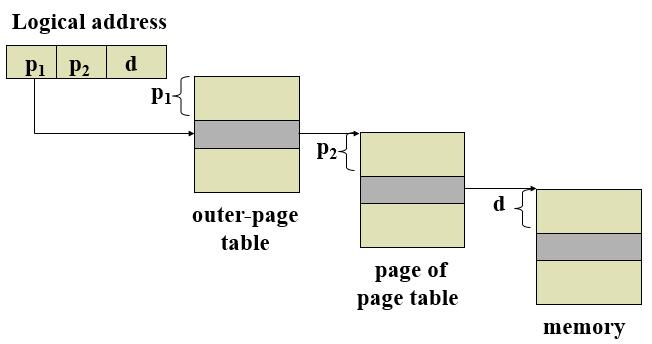
- **哈希页表（Hashed Page）** 以虚拟页码作为哈希值，每个条目包括一个链表用于处理碰撞。链表中的每个元素包含三个域：虚拟页码，对应帧号以及指向链表中下一个元素的指针。此种方式的地址映射过程如下：将虚拟页号哈希到表中某个条目，若该条目对应的链表存在元素，则按顺序比较直到找到对应的元素。哈希页表的一个变种是 **群集页表（clustered page table）** ，它的每个条目包括多页信息，因此一个条目存储了多个物理页帧的映射，这对于 **稀疏（sparse）** 地址空间非常有效，稀疏地址空间种的地址引用通常不连续并且散布在整个地址空间。
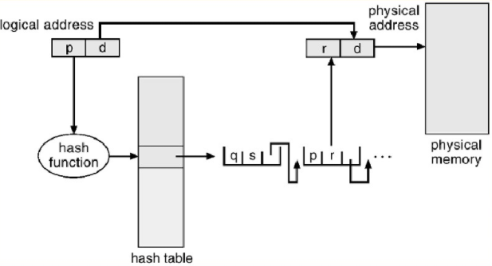
- **反向页表（inverted page table）** ：每个进程均维护一个相关页表，这个进程使用到的每个页在其持有的页表里有一项，或者每个虚拟地址在页表里都有一项而不论这个虚拟地址是否有效，此时每个页表会有很多项，这些表会消耗大量的内存，而其目的仅仅是追踪物理内存如何使用。反向页表中，每个真实的内存页/帧存在一个条目，该条目包括引用该物理帧的虚拟页号以及拥有该页的进程信息。所以整个系统只有一个页表，每个物理内存帧仅有一条相应的条目。
- 一种简化的反向页表实现（IBM RT 采用）：系统每个虚拟地址对应一个三元组 `<pid | page numbe r | offset>`，反向表中每个条目为 `<pid | page number>`，需要内存引用时，操作系统查找反向页表寻找匹配，若匹配找到则产生物理地址，否则认为产生了非法地址访问。这种方案减少了存储每个页表所需的内存空间，但增加了查找页表所需要的时间。反向页表按照物理地址排序，而查找依据虚拟地址，所以可能需要查找整个表来寻找匹配。可以使用 *哈希页表* 限制页表条目或加入 TLB 来改善。此外，采用反向页表的系统很难共享内存，因为每个物理帧只对应一个虚拟页条目。对于这种情况，可以允许页表的没一个条目仅包含一个虚拟地址到共享内存地址的映射，这时对未被映射虚拟地址的引用会导致页错误（page fault）。

### 分段

- 采用分页管理导致用户视角的内存和实际物理地址内存分离，对于装载/写入操作必须将虚拟内存映射到实际的物理内存。 **分段（segmentation）** 支持另一种用户视角，其逻辑地址空间由一些段组成，每个段有自己的编号和长度，用户通过段号和段内偏移（与分页的区别在于，分页管理中用户只指定一个虚拟地址，由硬件将虚拟地址拆分为页码和偏移，这些工作对程序员透明）来指定地址。
- 编译用户程序时，编译器会自动根据输入的程序源码构造段（代码段、静态区、堆、栈等），编译时链接的库可能被分配不同的段，加载程序时装入这些段并分配段号。
- 用户可以通过二维地址（段号、偏移）来引用存储单元，但实际物理内存仍然为一维的序列。操作系统通过 **段表（segment table）** 实现将二维用户定义地址映射到一维物理地址，段表的每个条目对应一个段，存储着该段的段号、段基地址（段在内存中开始的物理地址）和段界限（段的长度），对于某段超出段长的地址引用访问会导致硬件陷阱的触发。
- 段表在内存中的位置由 **段基址寄存器（segment table base register，STBR）** 和 **段长度寄存器（segment table length register，STLR）** 指定，当段号 s 满足 `s < STLR` 时该段合法。
- 分段会导致不连续的空闲内存空间以及外部碎片，从空闲内存为进程分配段也存在类似 *连续内存分配* 中的问题，有首次适应和最佳适应两种分配方式。
- 段可以被共享，多个进程可以通过相同段号共享同一个段。段的保护可通过类似页表中的保护位实现，段表中的每一条条目有一个合法位（为 0 表示不合法），同时也可以支持读/写/执行权限。

## 虚拟内存
- 进程的虚拟地址空间即为进程在内存中存放的 **逻辑** 视图，通常进程的的虚拟地址空间从某一个逻辑地址开始（比如 0）连续存放，如下图。随着动态内存分配，堆向上增长，子程序调用带来栈向下增长以及载入动态链接库时空白区域被填充。堆和栈之间的巨大的空白部分是虚拟地址的一部分，但只有在堆/栈生长时这部分虚拟地址才需要对应实际的物理帧。含有空白的虚拟地址空间称为 **稀（sparse）** 地址空间。

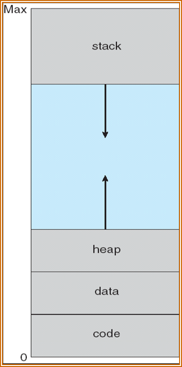

- 虚拟内存允许文件和内存通过共享页被多个进程共享，优势在于：
  - 系统库可被多个进程共享
  - 多个进程之间可以通过共享内存通信
  - 允许系统调用 `fork()` 创建进程之间的共享页从而加快进程创建。

### 按需调页
>在程序执行时，在需要时才调入相应的页

- 按需调页所需的硬件支持和分页、交换相同：

  - **页表** ：通过有效/无效位保护进程地址空间
  - **次级存储器** ：备份存储，保存不在内存中的页，通常为快速磁盘，用于和内存交换页的部分空间称为 **交换空间（swap space）** 。Linux 系统所需的 `/swap` 挂载点挂载的存储空间即为交换空间。

>请求调页的关键要求是能够在也错误后重新执行指令

### 写时复制

- 系统调用 `fork()` 是将子进程创建为父进程的副本，传统的 `fork()` 会为子进程创建一个父进程地址空间的副本，将父进程的页复制，但由于很多子进程创建之后立刻执行系统调用 `exec()`，因此复制父进程地址空间完全没有必要。 **写时复制（copy-on-write）** 技术允许父进程和子进程开始时共享同一页面，这些页面标记为写时复制页，如果任何一个进程对某一个写时复制页进行了写操作，则为这个进程创建一个该页的副本。注意， **只有可能被修改的页才会被标记为写时复制** ，对于不允许被修改的页面（如包含可执行代码的页）可以被父进程和子进程共享。
- 许多操作系统为分配空闲页请求提供了空闲缓冲 **池（pool）** ，池中的空闲页在进程的栈/堆需要扩展时可用于分配，或者用于管理写时复制页。操作系统通常使用 **按需填零（zero-fill-on-demand）** 技术分配这些页，这些页在分配之前被填入 0 覆盖，因此清除了之前的内容。
- **虚拟内存 fork** 是有的 UNIX 版本提供的 `fork()` 操作变种，`vfork()` 将父进程挂起，自己成使用父进程的地址空间，并且不采用写时复制。因此子进程对父进程地址空间的任何修改都会在父进程重启时可见。`vfork()` 主要用于子进程创建后立刻调用 `exec()` 的情况，它不会导致页面的复制操作，有时用来 **实现 shell 接口** 。

### 页面置换

- 增加多道程序的程度会导致内存的 **过度分配（over-allocating)** 。I/O 缓存也需要使用大量内存，缓存的使用会增加内存分配算法的压力，有的操作系统为 I/O 缓存分配了一定比例的内存，有的则允许用户进程和 I/O 子系统竞争全部系统内存。

- 内存的过度分配会导致某个进程触发了页错误而没有空闲帧可用，因为按需调页对用户而言透明，因此操作系统不应当直接终止进程（操作系统也可以交换出一个进程来降低多道程序的级别，这种选择有时是好的）。

- 页置换（page replacement） 

  发生在需要调页而没有空闲帧的情况，流程如下：

  - 查找所需页在磁盘上的位置
  - 查找空闲帧，若有则使用，否则通过页置换算法选择一个 **牺牲（victim）** 帧并将牺牲帧的内容写入备份存储（磁盘，交换空间），改变页表和帧表
  - 将所需页写入到空闲帧，并改变页表和帧表
  - 重启用户进程

- 可以看出，在没有帧空闲，需要页置换的情况下，会有两个页传输（一页换出，一页换入），这加倍了页错误处理时间。这一点可以通过在页表的每个条目中增加 **修改位（modify bit）** 或 **脏位（dirty bit）** 来降低额外开销，如果被置换出的页对应的修改位没有被设置，则说明此页从被调入内存后没有被修改，因此不必被写入回磁盘。

- 按需调页需要开发 **帧分配算法（frame-allocation algorithm）** 和 **页置换算法（page-replacement algorithm）** 。页置换算法的好坏可以计算页错误率评估：对于一个特定的内存地址引用序列，运行置换算法，计算出页错误的数量。这个引用序列称为 **引用串（reference string）** ，可以人工产生也可以跟踪一个真实的系统并记录其访问内存地址。利用两个事实可以降低引用串的数据量：只考虑内存引用的页码而不考虑完整地址；如果有对页 p 的引用，则紧跟着对页 p 的引用绝不会产生页错误。

- 理论上来说，我们期待增加可用帧（增加物理内存大小就会增加可用帧数量）的数量能够使页错误的数量相对应减少。 **Belady 异常（Belady’s anomaly）** 指违背这一期待的现象：对于有的页置换算法，页错误率甚至可能随着分配的物理帧数增加而增加，例如下面的 FIFO 算法。

#### 页面置换算法
##### FIFO页置换
##### 最优置换
##### LRU页置换
>双端链表加hash表

#### 针对应用程序选择页置换

- 有些情况下操作系统提供的虚拟内存会让部分应用程序性能下降。例如数据库提供了自己的内存管理和 I/O 缓冲，若操作系统同时也提供了 I/O 缓冲，则用于 I/O 的资源加倍。此外，对于一个执行大量顺序磁盘读操作的行为，LRU 算法删除旧页保持新页，而应用程序可能更需要旧页，此时 MFU 比 LRU 更高效。
- 有些操作系统允许特殊程序绕过文件系统的数据结构，将磁盘视作逻辑块数组使用。这种数组称为 **生磁盘（raw disk）** ，针对这样的数组的 I/O 称为生 I/O。

### 帧分配与系统颠簸

#### 最少需要帧数

- 分配的帧不能超过可用帧的数量（除非存在页共享），但也不能少于满足进程继续运行的帧数（minimum number of frames）。分配帧数不能过少的原因包括：
  - 性能：当分配给每个进程的帧数量减少时，页错误会增加从而减缓进程执行。
  - 页错误会导致指令重启：必须由足够的帧来容纳单条指令执行所需要的全部页。例如某台机器的机器指令都只有一个内存地址作为参数，此时至少需要一帧用于存储指令所在的页空间，还需要分配一帧用于存储指令引用的数据所在的页。如果此时允许一级间接引用（地址间接引用），则进程至少需要三个帧才能完成指令的执行，如果仅两帧可用，则进程将陷入无穷尽的页错误中。这种问题的最坏情况出现在允许多层间接引用的计算机中，对于多级引用，必须等到所有所需页都位于内存中指令才能执行，这种困难的解决方案是限制指令的间接引用级数，超出引用级数时触发陷阱。

#### 分配算法

- **平均分配（equal allocation）** ：给每个进程一个平均值，剩余的帧放置在空闲帧缓冲池中； **比例分配（proportional allocation）** ：根据进程大小按比例分配内存。这两种分配方式，每个进程分配的数量都会随多道程序的级别而变化，当多道程序程度增加时，每个进程都需要失去一定数量的帧来提供给新进程，同理，多道程序程度降低时离开进程占有的帧可以分配给剩余的进程。
- 比例分配可以根据进程的优先级（或者是优先级和大小的结合）而不是进程的大小来分配，这样可以给高优先级的进程更多的内存以加速执行。
- 多个进程竞争帧时，可将页置换算法分为 **全局置换（global replacement）** 和 **局部置换（local replacement）** 。全局置换允许进程从所有帧的集合（包括其他进程持有的帧）中选择置换帧，这将导致某个进程所获得的帧的数量可能改变（从其他进程处选择了一个帧置换）；而局部置换只能允许进程选择分配给自己的某个帧，此时分配给每个进程的帧数量保持不变。
- 全局置换算法的一个问题在于进程不能控制自己的页错误率，进程位于内存的页集合会受到其他进程调页行为的影响。此外，相同进程执行所需的时间在不同环境下可能有很大差异。但由于局部置换不能使用其他进程不常用的内存，所以全局置换有更好的系统吞吐量，因此更为常用。

#### 系统颠簸

- 当低优先级进程分配的帧数量少于体系结构所需的最少数量时，进程应当暂停执行并且换出分配的剩余帧，以使其他进程能够使用这部分帧空间。
- 对于分配帧数不足的进程，当进程缺少所需的页时触发页错误，此时必须置换某个页。如果当前所有页对于这个进程而言都是需要使用的页，则它置换出一个页后，又立刻需要这个页，因此它将频繁产生页错误并触发页调度行为。这称为 **颠簸（thrashing）** ： **如果一个进程在换页上用的时间多于执行时间，则这个进程在颠簸** 。
- 系统颠簸的原因在于：操作系统监控 CPU 使用率，CPU 利用率过低时会引入新进程来增加多道程序程度。然而，采用全局置换算法时，一个进程会置换任意进程的帧，这可能导致被换出页所属的进程也触发页错误，它们会再从其他进程中获取帧。 **这些链式反应带来的页调度行为将使进程排队等待换页设备，就绪队列变空，CPU 使用率降低，导致 CPU 调度程序随之增加多道程序程度，新进程将引发更多的页错误，CPU 使用率进一步降低** 。系统颠簸现象如下图。
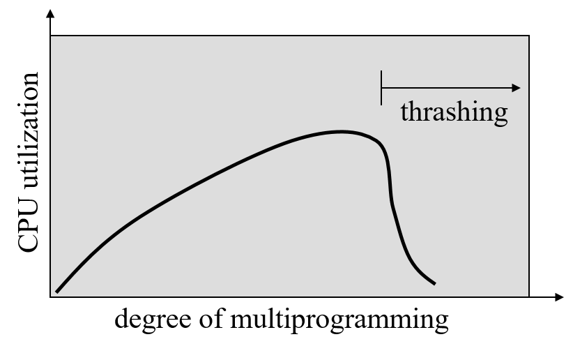
- 随着多道程序程度增加，CPU 使用率增加直到最大值，之后开始系统颠簸，此时必须降低多道程序程度才能增加 CPU 使用率并降低系统颠簸。 **局部置换算法（local replacement algorithm）** ，也称 **优先置换算法（priority replacement）** 可以限制系统颠簸：如果一个进程开始颠簸，则它不能从其它进程获得帧，但问题未得到彻底解决，一个进程颠簸时会花费大量时间等待调页设备，这将导致调页设备的平均等待队列变长，页错误的平均等待时间增加，此时其它未颠簸进程的有效访问时间也会增加。
- 要 **防止颠簸** ，必须给进程提供足够多的帧。 **局部模型（locality model）** 可以帮助确定进程实际正在使用多少帧，该模型说明，进程执行时在局部之间移动。 **局部是进程经常使用的页的集合，进程由多个不同局部组成且局部之间可能重叠** 。如果进程分配的帧数小于现有局部的大小，则进程会颠簸，因为它无法把所有常用页都放置在内存中。例如，进程调用了一个子程序，则其进入新的局部，这个新局部中的内存引用包括子程序的指令、局部变量以及子程序使用到的部分全局变量；当子程序退出时，进程从该局部返回主程序的局部（也可能在之后再次调用子程序进入该局部）。因此，局部是由程序和数据结构定义的，它是缓存的基础（cache、LRU 置换算法其实也都是基于局部性原理，在访问序列完全随机的情况下性能甚至不如 FIFO 算法），如果对任意数据访问完全随机而没有局部性原理，则缓存完全无用。

#### 工作集合模型

- **工作集合模型（working-set model）** 基于局部性假设，使用参数 Δ 定义 **工作集合窗口（working-set window）** ，其思想是检查最近 Δ 个页的引用，这最近 Δ 个引用页的集合称为工作集合。工作集合是程序局部的近似：一个正在使用的页位于工作集合中，一旦它已经 Δ 个时间单位未被使用，则会从工作集合中删除。
- 工作集合的精确度和 Δ 有关，Δ 太小则无法包含整个局部，过大则可能包含多个局部。工作集合最重要的属性是它的大小，系统内每个进程的工作集合大小 `WSSi` 之和 `D` 就是所有进程总的帧需求量，每个进程都会经常使用位于其工作集合内的页。当 `D > m` （`m` 是系统最大可用帧数量）时，就会有进程得不到足够的帧从而出现颠簸。
- 使用工作集合模型的内存分配过程如下：操作系统跟踪每个进程的工作集合，并给每个进程分配大于其工作集合大小的帧数。如果尚有空闲帧则可加入新进程；如果需要分配的帧数大于可用帧数，则操作系统选择、暂停一个进程，这个进程的所有页写出到备份存储，其已经占有的帧会被分配给其他进程。
- 工作集合模型的难点在于 **跟踪** ，每次内存引用都会增加新引用并丢弃老引用。 **固定定时中断和引用位可以近似模拟工作集合模型** 。例如 `Δ = 10000` 时，每 5000 个引用就产生一次定时中断，中断触发时将所有页的引用位复制，复制完成后清除。当发生页错误，系统检查当前的引用位和位于内存中的两个位（每次中断复制一位，10000 次引用中断 2 次因此复制了两个位）从而确定这一页是否在过去的 10000~15000 个引用中出现过（只要有至少一位为 1 就说明使用过，否则都为 0），若出现则认为该页在工作集合中。这种模拟并不很准确，因为无法准确获取该页究竟在 5000 个引用中的具体哪个位置出现，增加中断频率和历史位的位数可以提高准确性，但相应的也会增加中断处理时间。

#### 内存映射文件

- 通过虚拟内存技术将文件 I/O 作为普通内存访问的方法称为文件的 **内存映射（memory mapping）** 。文件的内存映射将一个磁盘块映射成内存的一页（或多页），开始时文件访问和普通的请求界面调度相同，并且产生页错误，这样一页大小的部分文件就会从文件系统读入到物理内存中（部分系统一次会读入多页大小内容）。通过内存操作文件而不是系统调用 `read()` 和 `write()` 能够简化文件访问和使用。
- 对映射到内存中的文件做写操作可能不会立刻写回到磁盘文件中。有的操作系统定期检查文件在内存中的映射是否被修改，并据此决定是否需要将内存的数据更新到磁盘上。关闭文件必然会导致内存映射的数据写回磁盘，同时从进程的虚拟内存中删除。
- 部分操作系统只能通过特定的系统调用提供内存映射，通过标准的系统调用处理所有其它的文件 I/O 请求；有的操作系统则一律将文件 I/O 视作内存映射，例如 Solaris 系统会将标明为内存映射的文件映射到进程的地址空间中，而对于采用普通系统调用（`read`、`open` 以及 `write`）访问的文件，Solaris 也会做内存映射，不过目标是内核地址空间。
- 一个文件可以同时映射到多个进程的虚拟地址空间中以实现 **数据共享** ：任何一个进程对共享虚拟内存中数据的修改都会被那些同样映射了这部分文件的进程看见（注意这里是为了实现数据共享，因此才允许多个进程修改同一页）。每个共享进程的虚拟内存表指向了物理内存的同一页。内存映射也支持写时复制，进程可以共享只读模式的文件，对于需要改动的数据，进程需要维护各自独立的副本。
- 其他设备的 I/O 操作也可以通过内存映射的方式：操作系统将一组内存地址专门映射到设备寄存器，对这些内存地址的读写等同于对设备寄存器的读写，即 I/O 端口。CPU 和设备之间传递数据可以通过轮询或中断。轮询方式指 CPU 不断查询控制位判断接收设备是否准备就绪；中断驱动则由接收设备通知 CPU 数据已经就绪。

#### 内核内存分配

- 普通用户进程获取额外内存时是从内核维护的空闲页帧链表中获取，该链表由页替换算法更新，这些页帧往往分散在物理内存中。
- 内核内存的分配通常从空闲内存池获取而非从普通用户进程的内存链表获取，原因：
  - 内核要为不同大小的数据结构分配内存，有些数据结构远不到一页的大小。很多操作系统的内核代码并不受分页系统控制，内核可以也必须谨慎分配内存并尽量降低碎片浪费。
  - 用户进程分配的页不一定非要在连续的物理内存中，但操作系统需要和硬件交流，需要内存常驻在连续的物理内存帧中。

# 文件系统
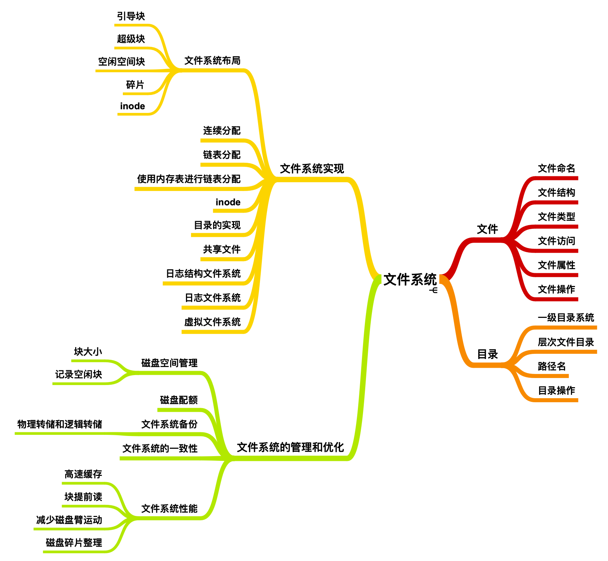

## 文件系统接口

### 概念、属性和操作

- 信息可以在多种介质上存储，为了方便使用，操作系统为不同的信息存储设备提供了统一的逻辑接口：对存储设备的各类属性加以抽象，定义了逻辑存储单元（文件），之后再将文件映射到非易失性的物理设备上。

- 文件是 **一系列有名称的、记录在二级存储器上的信息集合** 。从用户角度而言，文件是逻辑外存的最小分配单元，数据必须通过文件的形式才能写入到外存。文件根据不同的类型有一定 **结构（structure）** ，例如 *文本文件* 由行（页）组成，每行又由字符组成； *源文件* 由子程序和函数组成，子程序和函数又由声明、执行语句组成； *目标文件* 是一系列字节序列，按目标系统链接器所能理解的方式组成； *可执行文件* 为一系列可以装入程序调入内存执行的代码段。

- 所有文件的信息都保存在文件系统的目录结构中，目录结构（必须也是非易失性的）也保存在外存中。

### 文件属性（file attributes）

通常包括：

    - 名称：文件符号名称，按人类理解方式保存
    - 标识符：文件系统内标识此文件的唯一标签，通常为数字
    - 类型：此字段仅对于支持多类型文件系统有效
    - 位置：指向设备和设备上该文件位置的指针
    - 大小：文件当前大小，也可表示文件允许的最大容量
    - 保护：读、写、执行控制权限
    - 时间、日期、用户标识：文件创建、上次修改、最近访问等信息，用于保护、安全以及使用记录的追踪

### 文件操作

- 文件属于抽象数据类型（abstract data type）

  文件操作的最小集合包括如下六条，这六条基本操作可以组合以实现其他文件操作：

  - 创建文件：包括在文件系统中为文件找到空间并分配、在文件目录中为新文件创建条目；
  - 写文件：系统要为文件维护一个写位置的指针，一旦发生写操作就需要更新写指针（写方式 `fopen` 返回值就是一个写指针）；
  - 读文件：系统也需要为文件维护读指针，一个进程通常只对一个文件读或写，故当前操作位置（读/写指针）可作为每个进程 **当前文件位置指针（current-file-position pointer）** ；
  - 文件内重定位（repositioning within a file）：修改文件位置指针的值（seek 操作，文件寻址），这不需要执行真正的 I/O；
  - 删除文件：需要在目录中搜索给定名称文件，释放其空间并删除文件目录中的条目；
  - 截短（truncating）：删除文件内容而保留属性，将文件长度设为 0 并释放空间。

- 操作系统维护一个 **打开文件表（open-file table）** ，当需要一个文件时，操作系统根据这个表的索引来指定文件，避免了每次文件操作都要搜索文件目录。有的系统会在首次引用文件时隐式地打开它，绝大多数操作系统要求程序员通过 `open()` 操作显示地打开文件，并将文件条目复制到打开文件表中。当文件不再使用时，进程可以 *关闭* 这个文件，操作系统会从打开文件表删除文件对应的条目。系统调用 `open()` 会返回一个 **指向打开文件表中一个条目的指针** ，所有 I/O 操作会通过使用该指针来进行。

- 多个进程同时打开同一文件的情况下，操作系统通常采用 **两级内部表** ：单个进程的表和整个系统的表。其中单个进程的表追踪单个进程打开的所有文件（该进程对文件的使用信息，如该进程对该文件操作的指针位置、权限等），表中的每一个条目指向整个操作系统打开文件表中相对应的一项。而操作系统的打开文件表（整个系统的表）包含着与进程无关的文件信息（文件在磁盘的位置、大小等），一旦一个文件第一次被进程打开，操作系统会在打开文件表中增加相应的条目；而 **一个已经被打开的文件再次被其它进程打开时，仅仅在进程的打开文件表中增加一个指向整个系统表的相应条目** 。一般系统维护的打开文件表中，每个文件会有一个文件打开计数器，用来记录多少进程打开了该文件，当计数器降到 0 时标识文件不再使用，可以从打开文件表删除。

- 以上，每个打开文件应当包括如下信息：

  - 文件指针：这个属性对于每个进程都可能不同，因此它保存在进程各自的打开文件表中，每个进程都需要为自己打开的每个文件维护一个文件指针。
  - 文件打开计数器：此属性保存在操作系统的文件打开表中，操作系统等待所有进程均不在引用某文件（计数器为 0）后才会将其条目删除。
  - 文件磁盘位置：这一属性用于定位磁盘上的文件位置，保存在操作系统的打开文件表中。
  - 访问权限：此属性保存在进程各自的打开文件表中，操作系统根据进程各自的访问模式决定是否允许进程的 I/O 请求。

- 部分操作系统提供了 **文件锁** 以允许一个进程锁住文件，禁止其他进程访问。文件锁可以用于多个进程共享的文件（如多个进程访问、修改的系统日志）。其中， **共享锁（shared lock）** 类似 [进程同步](http://blog.forec.cn/2016/11/24/os-concepts-5/) 中读者-写者问题的读者锁，它允许多个进程并发获取； **专用锁（exclusive lock）** 类似写者锁，只有一个进程可以获取此锁。有的操作系统只提供专用锁。另外，操作系统可以提供 **强制（mandatory）** 或者 **建议（advisory）** 文件加锁机制，如果文件锁是强制的，那么操作系统会禁止其它进程访问一个已经加锁的文件；如果文件锁是建议的，则操作系统不会禁止。因此，对于建议加锁，程序开发者要确保进程适当的获取、释放锁。通常 Windows 系统采用强制加锁，而 UNIX 系统采用建议加锁。

### 访问方法

- **顺序访问（Sequential Access）** ：文件信息按顺序处理。这种访问模式最常用，如编辑器、编译器等均按此种方式访问。大量文件操作都是读写操作，两种操作都会向某一方向移动文件指针。顺序访问基于文件的磁带模型（读写/倒回），对顺序访问设备和随机访问设备都适用。
- **直接访问（Direct Access）** ：也称 **相对访问（relative access）** ，文件由固定长度的 **逻辑记录（logical records）** 组成，因此程序可以直接计算出文件所在的块并快速读写（磁盘允许对任意块进行随机读写）。数据库通常使用这种类型的文件。因为随机读写以块为目标，故文件操作要经过修改从而将块号作为参数。有两种方式：一是将 *读下一个字节* 变成 *读 n* ，将 *写下一个字节* 变成 *写 n* ；另一种则是仍使用 *读下一个* 和 *写下一个* ，但是增加了 *定位文件到 n* 的操作。用户向操作系统提交的块号是 **相对块号（relative block number）** ，是相对于文件开始的索引。
- 不是所有的操作系统都支持顺序访问和直接访问，部分系统只允许顺序或随机访问，有的则再文件创建时指定文件是顺序还是随机访问。对于直接访问的文件，可以非常容易的模拟出顺序访问，而在顺序访问文件中模拟直接访问是非常低效的。
- 其他访问方式通常建立在直接访问之上，涉及文件 **索引（index）** ，索引包含了各个块的指针。要查找文件记录，要先搜索索引，然后根据指针直接访问文件。

### 目录结构

- 磁盘（或其他大存储设备）可以当作整体运用在一个文件系统中，但有时需要在一个磁盘上安装多种文件系统。磁盘上各个部分称为 **分区（partitions）** 或 **片（slices）** ，或称为 **小型磁盘（minidisk，IBM）** 。每个磁盘分区可以创建一个文件系统，这些部分可以组合起来成为更大的结构 **卷（volume）** ，也可以在卷上创建文件系统。下面将 **存储文件系统的一大块空间作为卷** ，卷可以存放多个操作系统。包含文件系统的卷需要记录文件系统中的信息，这些信息保存在 **设备目录（device directory）** 或 **卷表（volume table of contents）** 中，它记录了卷上所有文件信息（名称、位置、大小、类型等）。

- 目录可以视作符号表，将文件名称转换成目录条目。目录需要支持如下操作：

  - 在目录中搜索文件
  - 创建文件
  - 删除文件
  - 遍历目录
  - 重命名文件
  - 跟踪文件系统：定期备份整个文件系统

- 组织目录结构的要求（补充）：

  - 高效（能够快速定位文件）
  - 命名（用户要方便命名、不同用户可以有同名文件、同一文件可以有多个名称）
  - 成组（可以按照文件属性划分成组）

- **单层结构目录（single-level directory）** ：所有文件保存在同一目录中，便于理解和支持。但当文件类型增加或者系统需要为多个用户提供服务时，必须保证所有文件名称唯一。文件名称长度有限，MS-DOS 只允许 11 个字符，UNIX 允许 255 个字符。

- **双层结构目录（two-level）**：单层目录结构会在不同用户直接引起文件名混淆，双层结构目录中，每个用户有自己的用户文件目录（user file directory，UFD），每个 UFD 都有相似的结构，但只包含所属用户的文件。用户作业执行/用户注册时，搜索主系统的主文件目录（master file directory，MFD）来检索到用户的 UFD，这允许多个用户拥有相同名称的文件。
  - 双层结构目录能够有效地对用户隔离，但不利于用户之间的合作和文件共享。双层结构目录等价于一棵高度为 2 的倒置树。
  - 对于系统库等每个进程都需要的文件，双层结构目录必须将这些系统文件复制到每个 UFD 下，这导致大量空间浪费，解决方法是修改搜索步骤，在根目录下定义一个特殊的用户目录，目录中包含所有的系统文件。当进程在 UFD 查找不到需要的文件时会搜索这个特殊用户目录。给定一个文件，搜索的一系列目录称为 **搜索路径（search path）** 。

- **树状目录结构（tree-structured directories）**：允许用户创建自己的子目录，系统内每个文件有唯一路径名。目录包括一组文件和子目录，目录实际也是一个按特殊方式访问的文件，文件系统中每个条目都需要一位定义其为文件（0）还是子目录（1），并且删除目录条目需要特殊的系统调用。

  - 通常每个进程有一个当前目录， **当前目录（current directory）** 包括进程当前感兴趣的多数文件，引用文件时也会先搜索当前目录。
  - 路径名分 **绝对路径名（absolute path name）** 和 **相对路径名（relative path name）** 。绝对路径名从根开始给出路径上的目录名，一直到指定文件；相对路径名从进程的当前目录开始定义路径。
  - 删除目录：如果目录为空可以直接删除，若目录不为空，有的系统不允许删除不为空的目录（MS-DOS，要删除一个有内容的目录就必须先清空整个目录内的文件），有的系统则提供了选择（选择是否允许删除全部子目录和文件，这样更危险，比如 `rm /* -rf`）。
  - 用户除了可以访问自己的文件，还可以通过路径名访问其他用户文件。

- **无环图目录（acyclic graph）**：树状结构禁止共享文件和目录，无环图允许目录含有共享子目录和文件。无环图是树状结构目录的扩展。
  - 共享目录不同于文件复制，共享情况下任何一个用户对文件做出的改动都对其它共享用户可见。
  - 实现 **共享目录方法** 1：创建一种称为 **链接（link）** 的新目录条目，链接实际是另一个文件/目录的指针，操作系统可以通过链接保存的路径名定位真实文件（这一行为称为 **解析（resolve）** 。
  - 实现共享目录方法 2：每个用户都有共享文件的副本，但这些副本时刻更新着所有被共享文件的信息。但这样做会使副本和原始的文件无法区分，并且一旦有用户修改了副本/原始文件，所有其它副本都需要修改以维护一致性。
  - 实现 **共享目录问题** 1：一个文件被共享，因此可能会有多个绝对路径指向了同一个文件，这时对于遍历文件系统/查找文件/统计文件数量/备份文件等操作，需要解决不重复计算的问题。
  - 实现共享目录问题 2：分配给共享文件的空间何时可以删除？若用户删除文件即删除，则会留下很多悬挂链接指向不存在的文件，如果删除部分的空间被其它文件使用，这样链接又会指向其他文件的某个部分。可以在文件删除时搜索并删除这些悬挂的链接，但相对耗时；或者直到某个进程使用了某个悬挂链接时再去清理（UNIX 和 Windows 系统均不会在删除文件时删除链接，而由用户意识到原来文件已经删除）
  - 实现共享目录问题 3：删除共享文件的另一种方式是保留文件直到所有指向该文件的引用都删除为止。这样需要为每个文件维护一个引用列表，这个引用列表可能很大。因此可以用一个计数器代替引用列表。UNIX 操作系统对 **硬链接（hard links，非符号链接）** 采用了这种方式。

- **通用图目录（general graph）**：无环图结构必须确保没有环，而对于无环图的共享部分，如果搜索一个共享子目录没有找到文件，就应该避免通过其它链接再次搜索这个共享子目录（浪费时间）。如果目录中甚至有环存在（例如子目录又包含了到父目录的链接），就更要避免循环搜索。

  - 避免循环搜索：限制搜索时访问目录的次数。
  - 删除文件：可能出现文件自我引用，这时需要垃圾收集机制确定什么时候可以删除引用。垃圾收集需要遍历整个文件系统并将所有能够访问到的空间标记，之后第二次遍历将第一遍没有标记的位置收集到空闲空间链表上。
  - 如何避免无环：仅允许链接到一个没有子目录的文件；垃圾回收；每次新链接加入都运行环检测算法判断。

### 文件共享

- 多用户操作系统必须控制文件共享。系统可以默认允许一个用户访问其他用户文件，也可以要求一个用户授予文件固定的访问权限。多用户系统需要比但用户系统维护更多的文件和目录属性，现在绝大多数系统采用了文件（目录） **拥有者（owner，user）** 和 **组（group）** 的概念，其中拥有者控制权最高，拥有者的 ID 会和文件属性一起保存。同一组的成员具有相同的权限，并只能执行拥有者具有权限的子集。

- 远程文件系统的实现方式包括：

  - 用户通过程序（ftp）在机器之间传输文件
  - **分布式文件系统（Distributed Information System）** ：远程目录可以从本机直接访问
  - 万维网（和 ftp 类似，基本是 ftp 的包装）：用浏览器下载文件

- C/S模型（客户机-服务器模型）：服务器包含文件，客户机访问文件。服务器需要表明目录和卷的哪些文件可用，而客户机的身份需要通过网络名称/IP 或者其它标识符鉴别（这些可能被欺骗/模仿），因此客户机需要通过加密密钥向服务器进行安全验证，安全验证也会遇到很多问题，所以多数情况还是使用不太安全的验证。

- **故障模式（Failure Modes）** ：本地文件系统可能因为某些原因出错，比如包含文件系统的磁盘老化，目录结构或者其它磁盘管理信息（统称为 **元数据，metadata** ）损坏等。用户或管理员的冒失也会导致文件丢失/整个目录删除等。远程文件系统因为网络因素，需要有更多的故障模式，客户机和服务器之间 **需要对每一次远程请求记录信息** 以在故障发生时能够恢复。类似 NFS 的协议对每个请求的信息都加以记录，因此能够很容易的从故障中恢复，但安全性较差。

- **一致性语义（Consistency Semantics）**：描述多用户同时访问共享文件时的语义，规定了一个用户修改的数据什么时候对另一个用户可见。

  - UNIX 语义（UFS）：用户对已经打开的文件进行写操作会立刻被其它同时打开这一文件的用户可见，还有一种共享模式会共享文件指针的位置，一个文件移动了文件指针会影响其他用户，文件有一个映像，这个映像允许来自不同用户的交替访问（映像是互斥资源）。（会导致用户进程延迟）
  - AFS 文件系统：用户对打开文件的写操作不会立刻被其他用户可见，一旦文件关闭，对文件的修改只能被以后打开的会话所见，已经打开文件的用户无法看到这些修改。一个文件会有多个物理映像，用户允许对自己的映像进行不受限制的读写操作（没有互斥）。
  - 不可修改共享文件语义：文件不可修改，即只读（文件名不能重用、文件内容不可修改）。

### 保护

- 计算机系统中保存的信息必须能够免受物理损坏（可靠性）和非法访问（保护）。对于多用户系统尤其需要某些机制。
- 访问类型：需要 **控制访问（controlled access）** 来限制可以进行的文件访问类型，访问类型包括：读、写、执行、添加、删除、列表清单（获取文件名称、属性等）。更多操作（重命名、编辑等）都是这些底层操作的组合，因此保护只需要在底层提供，高层操作涉及的底层操作如果不满足保护的要求就会被拒绝。
- 访问控制：根据用户身份判断能否对某个文件访问。每个文件/目录都增加一个 **访问控制列表（access-control list，ACL）** 来指定每个用户对这个文件/目录具有的合法的访问类型。缺点是访问控制列表会较长，并且一般事先无法知道系统的用户列表，这将导致更复杂的空间管理。
- 操作系统为每个文件提供了三种用户类型：拥有者、组（一组需要共享文件并且具有相同访问需求的用户集合）、其他用户。Linux 中每种类型的用户都有 `rwx` 三个位。

## 文件系统实现

### 文件系统结构

- 磁盘具有如下两个特点因而成为大容量多文件存储的方便介质：
  - 可以原地重写
  - 可以直接访问磁盘上任意一块信息
- 内存和磁盘之间的 I/O 转移以 **块** 为单位而非字节。每块为一个或多个扇区，扇区大小从 32 ~ 4096B 不等，通常是 512B。
- 文件系统包括多层，下图是一个分层的例子，每一层利用较低层的功能创建新功能以为更高层提供服务。
  - **I/O 控制** 是最底层，由 **设备驱动程序（device drivers）** 组成。
  - **基本文件系统（basic file system）** 只需要向设备驱动程序发送一般指令就可以对磁盘上的物理块做读写，每个块由它的磁盘地址标识（驱动器 1，柱面 73，磁道 3，扇区 10）。
  - **文件组织模块（file-organization module）** 直到文件和它的逻辑块、物理块。因为文件组织模块知道文件类型和位置，因此可以将逻辑块地址转换成基本文件系统用的物理块地址。它也包括 **空闲空间管理器** 用来追踪未分配的块。
  - **逻辑文件系统（logical file system）** 管理元数据，元数据包括文件系统的全部结构数据而不包括文件的具体内容。逻辑文件系统为文件组织模块提供所需的信息，通过 **文件控制块（file-control block，FCB）** 来维护文件结构，同时也负责保护和安全。
- 目前多数操作系统都支持多个文件系统，UNIX 使用 UNIX文件系统（UFS），基于伯克利快速文件系统（FFS）。标准的 Linux 文件系统是 **可扩展文件系统（extended file system）** ，常见版本有 ext2 和 ext3。

### 基本结构

- 磁盘上的文件系统涉及如下一些结构：
  - **（每个卷的）引导控制块（boot control block）** ：从这个卷引导操作系统所需要的信息，如果这个卷没有安装操作系统则这一块内容为空。它通常是卷的第一块，UFS 称之为 **引导块（boot block）** ，NTFS 系统称之为 **分区引导扇区（partition boot sector）** 。
  - **（每个卷的）卷控制块（volume control block）** ：包括卷或分区的详细信息，如分区块数、块大小、空闲块数量和指针、空闲 FCB 的数量和指针等。UFS 称之为 **超级块（superblock）** ，在 NTFS 中存储在 **主控文件表（Master File Table）** 。主控文件表采用关系型数据库，每个文件占据一行。
  - 每个文件的 FCB 包含文件的详细信息（文件权限、拥有者、大小、位置）等，UFS 称之为 **索引节点（inode）** 。

  |文件控制块的内容（FCB）|
  |---|
  |文件权限|
  |文件日期|
  |文件所有者、组、访问控制列表（ACL）|
  |文件大小|
  |文件数据块或文件数据块指针|
  ||

  - 每个文件系统的目录结构，这些目录结构用于组织文件。UFS 中目录结构包括文件名和相关的索引节点号，NTFS 则保存在主控文件表中。
- 内存内信息用于文件系统管理，可以通过缓存来提高性能。这部分数据在文件系统挂载（安装）的时候被加载，文件系统卸载的时候丢弃，可能包括：
  - 内存中的安装表，含有所有已安装卷的信息
  - 内存中的目录结构缓存，保存最近访问过的目录信息
  - **系统范围内的打开文件表** ，在文件系统接口中介绍过，包括每个打开文件的 FCB 副本和其它信息
  - **单个进程的打开文件表** ，每个条目包括指向系统范围内打开文件表的条目的指针以及与进程相关的其它文件信息
- 打开文件表的索引有多种名称，UFS 称之为 **文件描述符（file descriptor）** ，Windows 称之为 **文件句柄（file handle）** ，只要文件没有关闭，所有对文件的操作都是通过打开文件表执行的。文件系统中用户进程读文件的操作形式如下图所示。

### 分区和挂载

- 一个磁盘可以分成多个分区，一个卷也可能横跨多个磁盘上的多个分区（RAID 的一种形式）。

- 没有文件系统的分区称作 **生（raw）** 磁盘，含有文件系统的分区称为 **熟（cooked）** 的。生磁盘通常用于没有合适的文件系统可以使用的地方，例如 UNIX 的交换空间，或者有的数据库使用生磁盘并将其格式化来满足自己的需求。

- 引导信息可以包含在多个分区中，通常是一组有序块，并作为镜像文件读入内存。镜像文件会按照预先指定的位置开始执行，它除了可以启动一个特定的操作系统，还可以支持 **双引导（dual-booted）** ，即启动加载器知道有哪些操作系统、文件系统位于引导区，并可以引导磁盘上不同分区的不同类型的操作系统。

- **根分区（root partition）** 包括操作系统内核以及其它系统文件，它们在引导时装载到内存中，其它卷会根据操作系统的设定，要么在引导时自动装入，要么通过用户手动装入。当有一个新设备挂载（安装）时，操作系统会验证设备上的文件系统是否有效，并根据需要自动/手动纠正。验证通过后，操作系统会在内存中的 **挂载表/装入表（mount table）** 中标注该文件系统已经装入，并且存储与此文件系统有关的信息。

- **虚拟文件系统（Virtual File System，VFS）** 是文件系统接口和文件系统之间的一层，它的目的有：

  - 定义一个 VFS 接口将文件系统的通用操作和具体实现划分，多个 VFS 接口的实现能够在同一台机器共存，因此它允许访问安装在本地的多种类型的文件系统；
  - VFS 提供了在网络上唯一标识一个文件的机制。它基于 vnode 文件表示结构（包括一个唯一的数值标识符，它能够表明位于整个网络范围内的唯一文件，例如 UNIX 的索引节点 inode 在文件系统内是唯一的）。

### 目录实现

- **线性列表（linear list）** 是实现目录最简单的方法，运行非常低效。查找文件需要线性搜索，排序列表可以二分搜索，但排序的需求使文件创建/删除复杂化，它的优点在于可直接生成排序目录信息，可用 B 树实现。
- **哈希表（hash table）** ：在线性列表存储目录之上使用哈希表，根据文件名哈希出一个指向线性列表中元素的指针，需要一些措施避免 **冲突（collision）** 。其困难在于，如果使用固定大小的哈希表，当条目超出哈希表容量时需要扩充哈希表大小，并且设计新的哈希函数将文件名映射到新的范围内。可以使用 **chained-overflow** 哈希表，使表中元素为一个链表而非单个记录。虽然冲突将使每个链表长度较大，查找可能变慢，但仍比线性搜索快得多。

### 分配方法

#### 连续分配

- **连续分配（contiguous allocation）** 要求每个文件在磁盘上占据连续的块。磁盘地址有一个线性序列，如果只有一个作业按照这个序列的顺序访问磁盘，在访问了块 b 后访问块 b+1 就无需移动磁头，即使需要移动磁头也只需要移动一个磁道（从一个柱面的最后扇区到下个柱面第一扇区）。因此， **访问连续分配文件所需的寻道数最小，即使确实需要寻道，所花费的寻道时间也最小** 。在文件连续分配中，一个文件的目录条目包括文件占有的第一个块的地址，以及该文件分配的块的数量（分配区域的长度）。
- 连续分配文件访问非常容易，既可以顺序访问也可以随机访问。它也存在问题，例如如何为新文件寻找空间，这个问题可看作内存管理中 **动态存储分配** 问题的一个具体应用，即如何从一个空闲的孔列表中寻找一个满足大小为 n 的空间，常用首次适应和最佳适应。
- 连续分配方案的另一个问题是需要确定文件需要多少空间，这个知识是无法预知的。如果为一个文件分配的空间过小则文件可能无法原地扩展文件，这时要么终止用户程序并通知用户必须分配更多空间才能运行（这样用户就会过高的预估所需的磁盘空间造成浪费），要么找一个更大的孔，将文件复制到新空间，释放旧空间，但这比较耗时。
- 修正的连续分配方案：开始时为文件分配一块连续空间，一旦空间不够，另一块称为 **扩展（extent）** 的 **连续空间** 就会被分配给文件。这种情况下，文件块的位置就需要通过开始块地址、块数、指向下一个扩展的指针三项来确定。如果扩展太大，内部碎片会变得严重；随着扩展的分配、删除，外部碎片也将变得严重。(商用VFS使用扩展优化性能)

#### 链接分配

- **链接分配（linked allocation）** 解决了连续分配的全部问题。链接分配中，每个文件由分布在磁盘上各个位置的多个磁盘块组成，文件目录条目记录了一个文件第一块的指针和最后一块的指针。每一块都会有一个指向下一块的指针，用户无法使用存储这些指针的空间（例如一块有 512B，磁盘地址为 4B，则用户只可用 508B）。

- 链接分配对于创建/读/写文件的操作如下：

  - 创建新文件时只要简单的在目录中增加一个新条目，条目中有指向文件第一块的指针，初始化为 `nil` 以表明这是空文件，大小字段也是 0。
  - 写文件时通过空闲空间管理器寻找一个空闲块，这个块会被写入数据、链接到文件最后一个块的尾部，同时要更新这个文件在目录中条目的记录值（大小、最后一个块的地址）。
  - 读文件通过条目中存储的第一个块的地址，逐个向后寻找。

- 链接分配的缺点在于：

  - 只能用于文件的顺序访问，要找到文件的第 i 块必须要从第一块开始寻找，每次访问都需要读磁盘，这还需要涉及磁盘寻道的延迟。因此 **链接分配无法有效支持文件直接访问** 。
  - 指针需要空间，每一块都有一定空间被指针占用。这个问题的解决方法是将多个块组成 **簇（cluster）** ，按簇而不是块来分配（如一个簇有 4 块）。这样指针占用的磁盘空间百分比会下降，但增加了内部碎片。簇可以改善多数算法中的磁盘访问时间，因此在绝大多数操作系统中得到应用。
  - 可靠性：文件通过指针链接，一旦有一个指针丢失/损坏，整个文件都将崩溃。一个逃避性的解决方案是采用双向链表，或者给每个块存上文件名和相对块数（相对第一块是第几块），但这又增加了过多的额外开销。

- 链接分配方法的一个变种是**文件分配表（file-allocation table，FAT）**，它被应用于 MS-DOS 和 OS/2 操作系统。每个卷的开始部分存储文件分配表，卷内的每一块都在表中占有一项，这个表可以通过块号码索引，表中存储的值是这一块指向的下一块块号。

  - 文件在目录中的条目只含有文件第一块的块号，访问文件时按照 FAT 表中存储的链接关系一直向下寻找，直到最后一块（最后一块在 FAT 表中标记为一个特殊的文件结束值，可以根据这个值判断是否为最后一块）。
  - 要分配一个新的块，只需要在 FAT 表中找到第一个值为 0（值为 0 表示一个块没有被使用）的块，用新块的地址替换掉此前最后一块的文件结束值，并且用文件结束值替换 FAT 表中的 0。
  - FAT 需要采用缓存才能提高效率，否则可能导致大量的磁头寻道时间：磁头要移动到卷的开头读入 FAT 以获得块的位置，然后才能移动到块本身。最坏情况下每块的读取都要移动两次。但它的优点在于改善了随机访问时间， **因为 FAT 的存在，操作系统可以快速找到文件任意一块的位置** 。
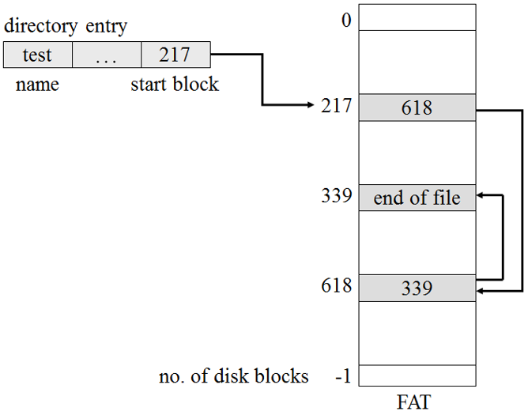

#### 索引分配

- 如果不采用 FAT，链接分配就无法有效支持直接访问，因为块指针散布在整个磁盘，必须顺序读取。 **索引分配（indexed allocation）** 把所有指针放到一起，通过 **索引块（index block）** 解决此问题。
- 每个文件都有自己的索引块，它是一个磁盘块地址的数组。索引块的第 i 个条目代表文件的第 i 个块，条目中含有索引块的磁盘地址。要读取第 i 块只需要通过索引块第 i 个条目存储的指针来访问（类似第八章分页）。
  - 创建文件：索引块中所有指针设为 nil。
  - 第一次写入第 i 块：从空闲空间管理器获取一个空闲块，将数据写入块，并将块地址写到索引块的第 i 个条目中
- **索引分配支持直接访问且没有外部碎片问题，但索引分配会浪费空间** ：如果一个文件只有两块长，链接分配只需要每块浪费一个指针，而索引分配需要为这个只有两块的文件创建一个完整的索引块，这个索引块里只有两个指针被使用到。
- 索引块的大小需要经过仔细考量：每个文件都有一个索引块，索引块太大会造成浪费，太小又不足以满足大文件存储需求。针对这一问题的处理机制有如下几点：
  - **链接方案（Linked scheme）** ：一个索引块就是一个磁盘块。它本身能够直接读写，当遇到大文件存储时可以将多个索引块链接。例如一个索引块可以包含一个头部（头部包含文件名）以及 100 个磁盘块的地址。索引块的最后一个存储单元存储着指向下一个索引块的地址如果是小文件则这个指针为 `nil`，如果是大文件则指向了另一个索引块。
  - **多层索引（Multilevel index）** ：设置两层索引块，第一层指向第二层，第二层指向文件块。根据最大文件大小的不同，可以继续到第三/四层。对于块大小为 4KB 的情况，可以在一个索引块里装入 1024 个 4B 指针，两层索引就可以容纳 1048 576 个数据块，即最大文件为 4GB。
  - **组合方案（Combined scheme）** ：在 UFS 中使用了这种方案。将索引块的前 15 个指针存在文件的 inode 里，这 15 个指针中：前 12 个直接指向了数据块，这样不超过 12 块的文件就不需要其它索引块；后 3 个指针分别是一级间接块、二级间接块、三级间接块指针。这种方法允许一个文件的块数超过 4B 文件指针能访问的空间。许多 UNIX 系统支持 64 位文件指针，这时允许文件/文件系统达到数 T 字节。UNIX 的inode 大致如下：
    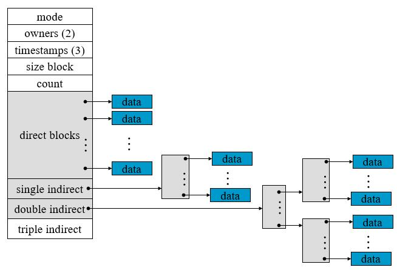
- 索引分配方案和链接分配方案在性能上都有欠缺，虽然索引块能够缓存在内存里，但数据块会分布到整个分区中。

#### 性能

- 连续分配对于任意类型的访问都只需要访问一次，链接分配可以将下一块的地址放到内存中并能直接读取，但对于直接访问需要读多次磁盘。所以有些系统通过使用连续分配支持文件直接访问，通过链接分配支持顺序访问。这种系统在创建文件时就要指明文件的类型（顺序访问还是直接访问），如果是直接访问还必须说明最大文件大小。
- 索引分配非常复杂。如果索引块已在内存中则可以直接访问，但将索引块保存在内存中需要非常大的空间。尤其是多级索引，对于一个大文件来说，如果要访问文件末尾部分的数据，可能需要将所有索引块读入内存才能读到需要的数据库。所以索引分配的性能依赖于索引结构、文件大小和所需要的块的位置。
- 有的系统把连续分配和索引分配结合，对于小文件（3、4块大小的）采用连续分配，大文件切换到索引分配。因为文件系统中大多数文件较小，所以小文件连续分配效率较高，平均性能较好。
- 由于 CPU 和磁盘速度不等，花费数千条 CPU 指令来节省一些磁头移动都是值得的，随着时间推移，这种不等程度还会增加。

### 空闲空间管理

- 系统需要维护 **空闲空间链表（free-space list）** 以记录空闲磁盘空间，创建文件时会从空闲空间链表分配，删除文件时磁盘空间会加回到空闲空间链表上（称之为链表但不一定表现为链表）。

#### 位向量

- 将空闲空间用 **位图（bit map）** 或 **位向量（bit vector）** 表示，每块用一位说明是否为空闲，1 表示空闲，0 表示已经分配。
- 此方式查找磁盘上第 1 个空闲块和 n 个连续空闲块时简单高效：
  - 按顺序检查位图中的每个字是否为 0 即可确定对应的块是否已经全部分配，第一个非 0 的字中，第一个 1 位偏移旧对应着第一个空闲块；
  - 连续 n 个空闲块只需要判断是否有连续 `[n / 字的位数]` 个字均为最大值（如一个字就是一个字节时，只要连续有 `[n / 8]` 个字节全为 255 就说明这部分块都空闲）。
- 除非整个位向量都能保存在内存中，否则位向量的效率不高。对于小磁盘，位向量的大小可以接受，但对于大磁盘而言（如 40GB，每块 1KB）就需要超过 5MB 空间存储位图。

#### 链表和组

- 将所有空闲磁盘块用 **链表（Linked List）** 链接，将指向第一个空闲块的指针放在磁盘的一个特殊位置，同时也缓存到内存里。第一块空闲块中包含了指向下一个空闲磁盘块的指针。
- 此方案效率不高，要遍历整个空闲块列表需要从磁盘读出每一块，这要耗费大量 I/O 时间。不过通常操作系统只需要获得一个空闲块以提供给文件，因此一般只需要分配空闲表的第一块。
- **组（grouping）** 是对空闲链表的改进：将 n 个空闲块的地址存在第一个空闲块里，前 n-1 个地址都指向真正的空闲块， **最后一个地址指向了另一个包含另外 n 个空闲块的块地址** 。

#### 计数

- 通常会有多个连续的块需要同时分配、释放，尤其是采用了连续分配或簇的情况下。因此可以不记录 n 个空闲块地址，而是记录连续多块空闲块的第一块的地址，以及连续的空闲块的数量。这样空闲空间表的每个条目包含了第一个空闲块地址和连续空闲块数量，虽然每个条目占用的空间增长了，但表的总长度会缩短（连续空闲块的数量往往大于 1）。

#### UNIX 成组链接（补充）

- 将文件存储设备中的所有的空闲块 **从后向前** 按 50 块为一组进行划分，每组的第一块用于存放 **前一组** 的总块数和每块的块号，因为第一组前面已经没有其他组存在，所以第一组实际有 49 块。因为存储空间不一定正好是 50 的整数倍，所以最后一组可能不足 50 块。因为最后一组后面没有其他组，所以最后一组的总块数和每块块号的信息存放到管理文件存储设备的文件资源表中。如下图所示。

- 操作系统启动时将文件资源表复制到内存，此时文件资源表中包含了最后一组的空闲块总数以及空闲块的块号。操作系统还会设置一个用于空闲块分配、回收的堆栈，堆栈存储着空闲块的块号，栈指针 ptr 的初值等于最后一组的空闲块的总块数。
- 成组链接分配方法：申请者请求获得 n 块空闲块，操作系统将按照先进先出的原则，将栈顶指向的块号分配给请求者，同时 ptr 自减。重复此操作直到 n 块分配完毕，或者堆栈中只剩下最后一个空闲块的块号（此块实际存储的是下一组的空闲块块数和各块块号）。当堆栈只剩下最后一个空闲块的块号时：
  - 从堆栈中弹出该块的块号，系统启动 I/O 设备，将该块存放的内容读入内存（即将下一组空闲块号和总块数读入空闲资源表），并设置 ptr 为下一组的空闲块数
  - 文件存储设备的最后一个空闲块中设置有尾部标识，表示空闲块已经分配完毕
- 成组链接回收方法：用户删除某个文件时，ptr 自增并将空闲块号入栈。若 ptr 为 50 则表明当前已经凑足一组，该组回收结束。
  - 如果还有空闲物理块 F 需要回收，则将块 F 回收，并且启动设备 I/O，把栈中记录的 50 个块号和块数（50）写入到块 F 中。设置 ptr 为 1，将块 F 的块号入栈，开始新的一组空闲块回收。
  - 对空闲块的分配和回收操作必须互斥进行（栈操作要互斥）。

## 大容量存储器的结构

### 概览

- **磁盘（magnetic disk）** 是现代计算机系统使用的大容量外存。磁盘片为扁平原盘，两面均涂有磁质材料，读写头在磁盘片的表面飞行，磁头和 **磁臂（disk arm）** 相连 ，磁臂将每个盘面两侧的全部磁头作为一个整体一起移动。磁盘片表面被逻辑划分为圆形 **磁道（track）** ，一圈磁道被进一步划分为 **扇区（sector）** 。同一圈磁道在不同盘片的集合组成了 **柱面（cylinder）** 。磁盘结构如下图。
  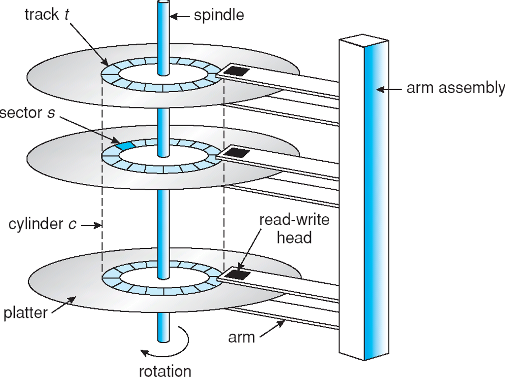]
- 多数驱动器每秒可旋转 60~200 圈，磁盘速度由 **传输速率（transfer rate）** 和 **定位时间（positioning time）** 决定。其中传输速率指驱动器和计算机之间的数据传输速率；定位时间又称 **随机访问时间（random access time）** ，包括 **寻道时间（seek time）** （移动磁臂到所需柱面所需的时间） 和 **旋转等待时间（rotational latency）** （等待磁盘驱动器将所需扇区旋转到磁头下的时间）。寻道时间和旋转等待时间通常为几毫秒，典型的磁盘能够以几兆每秒的速率传输。
- 磁盘的传输速率总是低于有效的传输速率。 **磁盘表现的传输速率是磁盘头从磁性介质读取比特的速率** ，这不同于给操作系统传输块的速率（与操作系统之间传输的速率才是决定磁盘速度的传输速率）。
- 磁头飞行在盘片数微米上的空气层中，一旦磁头和盘片接触就会损坏磁盘表面，这称为 **磁头碰撞（head crash）** 。磁头碰撞不能修复，整个磁盘必须替换。
- 磁盘可移动或更换。 **软盘（floppy disk）** 是便宜的可移动磁盘，存储容量在 1.44MB 左右。
- 磁盘驱动器通过 **I/O总线** 和计算机相连，可用的总线包括 **EIDE（enhanced integrated drive electronics）** 、 **ATA（advanced technology attachment）** 和 **串行 ATA（serial ATA，SATA）** 、 **USB（universal serial bus）** 、 **FC（fiber channel）** 和 SCSI 总线。
- **控制器（controller）** 是一个特殊处理器，用于执行总线上的数据传输。其中， **主机（host）** 控制器是计算机上位于总线末端的控制器，而 **磁盘（disk）** 控制器位于磁盘驱动器内。
- **磁带（magnetic tape）** 是早期次级存储介质，但访问速度过慢。典型磁带可以存储 20~200GB。
- **火线（FireWire）** 指一个接口，这个接口可以将外部设备如磁盘驱动器、DVD 驱动器等连接到计算机系统。

### 磁盘结构和附属

- 现代磁盘驱动器可以看作一个一维的 **逻辑块（logical blocks）** 数组，逻辑块是最小的传输单位，通常为 512B，部分磁盘可以通过 **低级格式化（low-level formatted）** 来选择不同的逻辑块大小。

- 一维逻辑块数组按顺序映射到磁盘的扇区，扇区 0 是最外面柱面的第一个磁道的第一个扇区，这个映射关系先按磁道内的扇区顺序，之后按这一柱面上各个盘面的磁道顺序，最后按照从外向内的柱面顺序排序。通过这种映射，可以将逻辑块号转换为磁盘内的柱面号、柱面内的磁道号以及磁道内的扇区号。这种转换有一些问题，原因在于：

  - 多数磁盘有一些缺陷扇区，这时候映射需要用其它空闲扇区替代这些缺陷扇区
  - 有些磁盘每个磁道上的扇区数不是常量

- 对于使用 **常量线性速度（constant linear velocity，CLV）** 的介质，每个磁道的位密度均匀，离盘片中心更远的磁道的长度更长，容纳的扇区也就更多，这样从内向外的磁道所包含的扇区数就会逐渐增多，外部磁道的扇区数通常比内部磁道的扇区数多 40%。这时，盘片驱动器在磁头的不同位置的旋转速度将不同，磁头越靠近盘片中心则旋转速度越快。

- 硬盘中通常采用 **恒定圆角速度（constant angular velocity，CAV）** ，这时内磁道到外磁道的位密度会不断降低，以使磁盘驱动器转速恒定的情况下也能维持恒定的数据率。

- 计算机访问磁盘可通过 I/O 端口，或称 **主机附属存储（host-attached storage）** ，这一般在小系统中采用；或者通过分布式文件系统的远程主机，这称为 **网络附属存储（network-attached storage）** 。

- **存储区域网络（storage area network,SAN）** 是服务器与存储单元之间的私有网络（采用存储协议而不是网络协议）
  - SAN的优势在于其灵活性。多个主机和多个存储阵列可以附加在同一SAN上，存储可以动态地分配给主机。
- 
  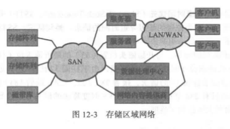

### 磁盘调度

- 强调磁盘的几个参数：
  - **寻道时间** 是磁臂旋转以使磁头位于目标扇区所属的柱面上的时间
  - **旋转延迟** 是磁盘驱动器将盘片旋转以使目标扇区转动到磁头下的时间
  - **磁盘带宽** 是传输的总字节数除以从 *服务* 请求开始到传递结束的总时间。可以通过磁盘 I/O 请求调度来排列访问顺序，从而提高访问速度和带宽。
- 进程需要磁盘 I/O 操作时会向操作系统发出系统调用，这个调用请求包括：
  - 操作类型：输入/输出
  - 本次传输的磁盘地址、内存地址、扇区数
- 多个进程的多道程序系统，磁盘队列可能有多个待处理请求，此时操作系统需对磁盘请求进行调度，包括 FCFS、SSTF、SCAN、C-SCAN、LOOK、C-LOOK。

#### FCFS 调度

- 先来先服务算法，此算法比较公平但无法提供最快的服务。

#### SSTF 调度

- **最短寻道时间优先法（shortest-seek-time-first，SSTF）** 会先处理最靠近当前磁头位置的请求，即选择距离当前磁头位置所需寻道时间最短的请求来处理。
- 本质上是最短作业优先（SJF）调度，但与 SJF 类似，它可能导致一些请求得不到服务，如果待处理请求队列比较长，很有可能某个请求会产生饥饿。SSTF 调度相比 FCFS 调度有很大改善，但仍不是最优的。

#### SCAN 和 C-SCAN 调度

- SCAN 算法有时称为 **电梯算法（elevator algorithm）** ，磁臂会从磁盘的一端向另一端移动（按一维逻辑块数组的顺序），当磁头移动过每个柱面时就会处理这个柱面的服务请求。到达另一端后磁头会反向继续移动，如此往返。
- 如果一个请求刚好在磁头移动到请求位置之前加入磁盘请求队列，则它会马上得到服务
- 如果一个请求刚好在磁头移动过请求位置后加入队列，则它需要等待磁头到达另一端并调转方向、返回后才能得到服务
- **C-SCAN（circular SCAN）** 调度和 SCAN 类似，但当磁头从磁盘的 0 号扇区移动到磁盘的最后一个扇区（或者柱面）后不会调转方向，而是从 0 号重新开始扫描整个磁盘。
- 这两种算法都不会导致饥饿现象。

#### LOOK 和 C-LOOK 调度

- LOOK 和 SCAN 算法类似，磁头向一个方向移动，但不会一直移动到最后一个柱面才折返，而是处理完这个方向上最后一个请求后就掉头。
- C-LOOK 和 C-SCAN 类似，处理完最后一个请求后就会将磁头恢复到磁盘一端重新开始按固定顺序扫描。

#### 算法选择

- 磁盘服务请求很大程度上受文件分配方法影响：一个连续分配文件会产生几个磁盘上相近位置的请求，而链接/索引文件会产生很多分散在磁盘上的块。
- 目录和索引块在磁盘上的位置也很重要，如果目录位于第一个柱面而文件数据位于最后一个柱面，则磁头需要横跨整个磁盘宽度。如果目录在中央柱面，则磁头只需要移动不到一半的磁盘宽度。
- 磁盘调度算法应该作为一个操作系统的独立模块，在必要的时候模块应该可以被替换。**SSTF** 或 **LOOK** 算法是比较合理的默认算法。
- 调度算法只考虑了寻道距离。旋转延迟几乎和寻道时间一样，但操作系统无法通过调度改善旋转延迟，因为现代磁盘并不透露逻辑块的物理位置。磁盘制造商会在磁盘控制器中加入磁盘调度算法缓解寻道时间和旋转延迟问题。
- 因为操作系统对请求服务的顺序有更多限制（如按需分页的 I/O 请求比普通应用程序的 I/O 请求优先级高），因此操作系统不能完全将磁盘调度交给磁盘控制器，而是选择自己的磁盘调度算法，将请求按调度好的顺序、按批次交给磁盘控制器。

### 磁盘管理

#### 磁盘格式化

- 新磁盘仅仅是含有磁性记录材料的盘片，需要通过 **低级格式化（物理格式化，physical formatting）** 分为扇区。
- 低级格式化将磁盘的每个扇区按特定的数据结构填充数据，扇区的数据结构包括头、数据区（通常 512B）和尾部。头部和尾部包含磁盘控制器需要的信息，如扇区号码和 **纠错代码（error-correcting code，ECC）** 。
- 操作系统需要将自己的数据结构记录到磁盘上，首先需要将磁盘分为一个或多个柱面组成的分区，操作系统可以将每个分区视作独立的磁盘。分区之后，操作系统需要通过 **逻辑格式化（logical formatting）** 来创建文件系统，操作系统会将初始的文件系统数据结构存储到磁盘上。这些数据结构包括那些仍空闲的和已经分配的空间（如分配给 FAT 或者 inode）和一个初始为空的目录。
- 为提高效率，多数操作系统将多个块集中到一大块，称为 **簇（cluster）** 。磁盘 I/O 通过块完成，文件系统 I/O 通过簇完成。

#### 引导块

- 计算机开始运行时需要初始化（自举，bootstrap）程序，它负责初始化系统所需的各个方面，并找到磁盘上的操作系统内核，将其装入内存开始执行。
- 自举程序保存在 **只读存储器（ROM）** 中，其位置固定，并且只读（不受病毒影响），但改变自举代码就需要改变 ROM 硬件芯片。因此操作系统只在启动 ROM 中保留一个非常小的自举程序，这个小自举程序会从磁盘上调入更完整的自举程序。更完整的自举程序可以修改，并且保存在磁盘的启动块上。
- 磁盘的 **启动块（boot blocks）** 位于磁盘的固定位置，拥有启动分区的磁盘称为 **启动磁盘（boot disk）** 或者 **系统磁盘（system disk）** 。启动 ROM 中的代码将启动块中的代码装入内存并执行，启动块中的完整自举程序会从 **非固定位置** 装入整个操作系统并执行。
- 以 Windows 2000 为例，其启动代码放置在硬盘的第一个扇区，被称为 **主引导记录（master boot record，MBR）** ，MRB 中除了包含自举程序的代码，还包含硬盘分区列表和系统引导分区的具体标识。Win 2000 将硬盘分成多个分区，其中一个为 **引导分区（boot partition）** ，该分区包括了操作系统和设备驱动程序。MBR 确定引导分区的位置后就会读取引导分区的第一个扇区（引导扇区，boot sector）并继续剩余的启动过程。

#### 坏块

- 磁盘有移动部件且容错能力小，容易出问题。多数磁盘从工厂出来就有 **坏块（bad blocks）** 。坏块中的数据会丢失。
- 简单磁盘可手动处理坏扇区。如 MS-DOS 的 `format` 命令执行逻辑格式化时，会扫描磁盘查找坏扇区，如果找到就在 FAT 的条目中写上特殊值以标明该块已损毁。
- 复杂磁盘（高端 PC、WorkStation 或服务器上的 SCSI 磁盘）需要控制器维护一个磁盘坏块链表，这个链表在磁盘出厂前进行低级格式化时就已经初始化，并在磁盘使用过程中不断更新。低级格式化会将一些块备用，操作系统无法看到这些块。当坏块出现时，控制器会用备用块替换这些坏块。这种方案称为 **扇区备用（sector sparing）** 或 **转寄（forwarding）** 。
- 典型的坏块区事务处理：
  - 操作系统访问逻辑块 87
  - 控制器计算该块的 ECC 值，发现该块已经损坏，因此将结果通知操作系统
  - 下次操作系统重启时运行特殊程序告知 SCSI 控制器用备用块替代坏块
  - 之后的每次系统访问逻辑块 87，请求都会被转换成替代后的备用块地址
- 扇区备用的另一方案是 **扇区滑动（sector slipping）** ：假定逻辑块 17 损坏，第一个可用的备用块是扇区 203，则将 18 ~ 202 扇区向下滑动一个扇区，变为 19 ~ 203 扇区。这样原本的扇区 18 变为空，用来替换扇区 17。

### 交换空间管理

### RAID结构
>磁盘冗余阵列技术，用于提高性能和可靠性

- 通过引入冗余来解决可靠性问题
- 通过并行处理来改善性能
  - 对于多个磁盘，通过在多个磁盘上分散数据，可以改善传输率。位级分散和块级分散。
>1 通过符合均衡，增加多个小访问（页访问）的吞吐量
 2 降低大访问的响应时间

RAID0：
- RAID0 的读写性能理论上是单块磁盘的N倍（仅限理论，因为实际中磁盘的寻址时间也是性能占用的大头）

- 它并不提供数据校验或冗余备份，因此一旦某块磁盘损坏了，数据就直接丢失，无法恢复了。因此RAID0就不可能用于高要求的业务中，但可以用在对可靠性要求不高，对读写性能要求高的场景中。
  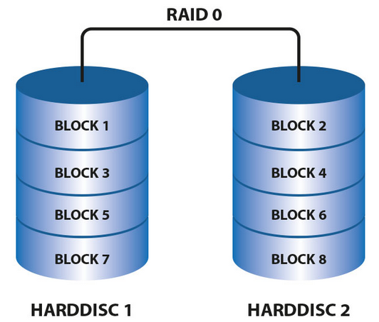

RAID1:
- RAID1 是磁盘阵列中单位成本最高的一种方式。因为它的原理是在往磁盘写数据的时候，将同一份数据无差别的写两份到磁盘，分别写到工作磁盘和镜像磁盘，那么它的实际空间使用率只有50%了，两块磁盘当做一块用，这是一种比较昂贵的方案。
- RAID1其实与RAID0效果刚好相反。RAID1 这种写双份的做法，就给数据做了一个冗余备份。这样的话，任何一块磁盘损坏了，都可以再基于另外一块磁盘去恢复数据，数据的可靠性非常强，但性能相对损失
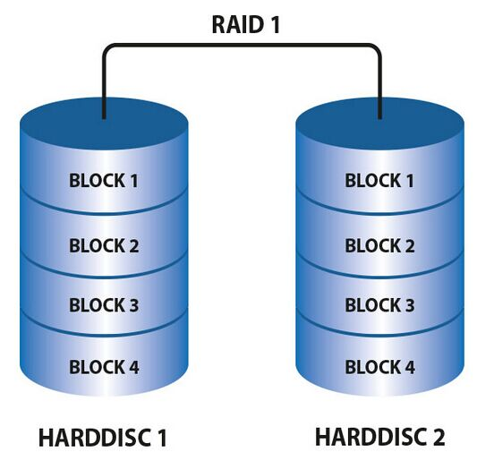

RAID5:
- 不再需要用单独的磁盘写校验码了。它把校验码信息分布到各个磁盘上。例如，总共有N块磁盘，那么会将要写入的数据分成N份，并发的写入到N块磁盘中，同时还将数据的校验码信息也写入到这N块磁盘中（数据与对应的校验码信息必须得分开存储在不同的磁盘上）。一旦某一块磁盘损坏了，就可以用剩下的数据和对应的奇偶校验码信息去恢复损坏的数据。
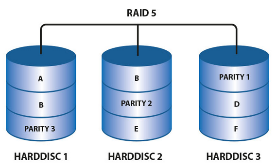

RAID6:
- 除了每块磁盘上都有同级数据XOR校验区以外，还有针对每个数据块的XOR校验区，这样的话，相当于每个数据块有两个校验保护措施，因此数据的冗余性更高了。

- 但是RAID6的这种设计也带来了很高的复杂度，虽然数据冗余性好，读取的效率也比较高，但是写数据的性能就很差。

RAID10：
- 首先基于RAID1模式将磁盘分为2份，当要写入数据的时候，将所有的数据在两份磁盘上同时写入，相当于写了双份数据，起到了数据保障的作用。且在每一份磁盘上又会基于RAID0技术讲数据分为N份并发的读写，这样也保障了数据的效率。
- 只有一半的磁盘用于冗余数据，浪费严重

## I/O输入系统
### I/O硬件
- **设备驱动程序（device drivers）** 为 I/O 子系统提供了统一设备的访问接口。
- 设备和计算机的通信通过 **端口（port）** ，一组被一个/多个设备共同使用的线称为 **总线（bus）** 。总线是一组线和一组严格定义的描述在线上传输信息的协议。 **链环（daisy chaine）** 形容的是多个设备相连，最终设备通过端口连接到计算机上的模式。链环常常按总线方式工作，一个典型的 PC 总线结构如下图。
  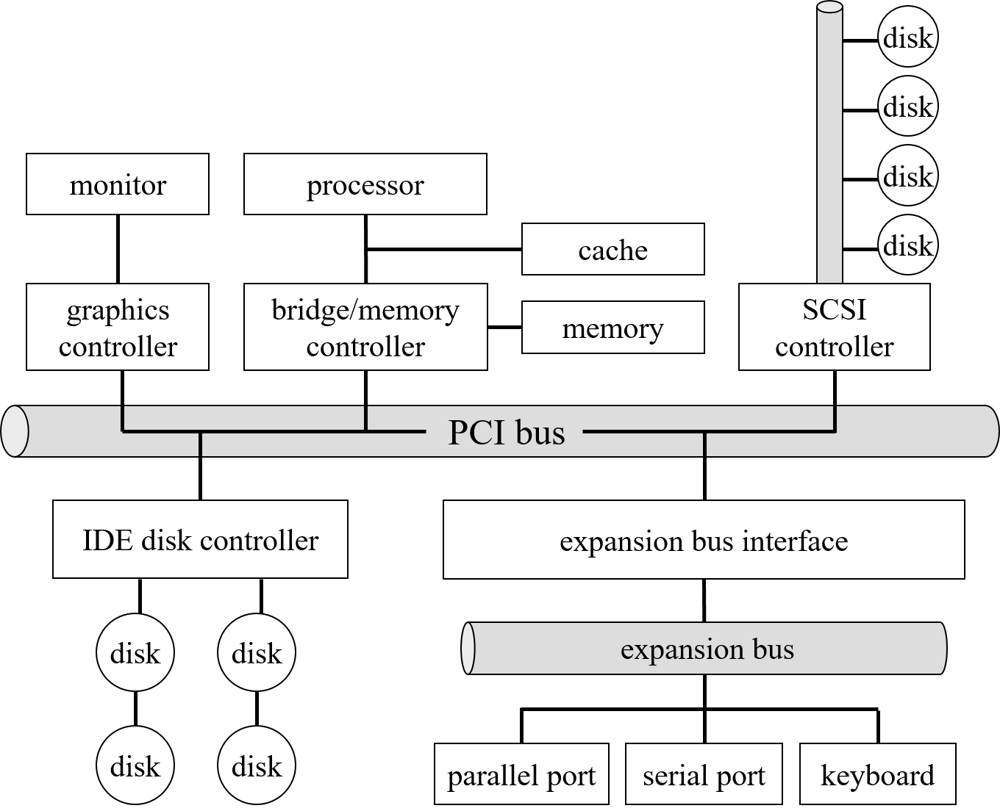
- 上图中包含一个 **PCI 总线** （最常用的 PC 系统总线）用于连接 CPU 和内存子系统/快速设备， **扩展总线（expansion bus）** 用于连接串/并行端口和相对慢的设备（键盘）。
- **控制器（controller）** 是用来操作端口、总线或者设备的一组电子器件，它的复杂程度和传输协议有关，如串行端口控制器比较简单，而 SCSI 总线控制器常实现为一个和计算机相连的独立的 **主机适配器（host adapter）** ，这个适配器会有处理器、微码以及一定的私有内存，从而能够处理 SCSI 协议信息。
- 控制器有一个/多个用于数据和控制信号的寄存器， **处理器通过读写这些寄存器来实现与控制器的通信** 。这种通信的可以通过特殊的 I/O 指令向指定的 I/O 端口地址传输一个字节/字，也可以通过 **内存映射** I/O 模式（在虚拟内存中介绍过），处理器能够通过标准数据传输指令完成对控制器的读写。部分系统同时采用这两种方式，例如图像控制器有 I/O 端口来完成基本控制操作，还有一个较大的内存映射区域来支持屏幕内容的接收和生成。
- I/O 端口通常有 4 种寄存器，寄存器通常为 1 ~ 4B：状态寄存器、控制寄存器、数据输入寄存器和数据输出寄存器。有的控制器有 FIFO 芯片从而可以保留多个输入/输出数据。上述四种寄存器的主要功能有：
  - 主机从 **数据输入寄存器** 读出数据
  - 主机向 **数据输出寄存器** 写入数据
  - 主机可从 **状态寄存器** 读出设备当前的状态
  - 主机向 **控制寄存器** 写入数据来发送命令、改变设备状态

#### 轮询

- 主机和控制器之间交互很复杂，但基本的**握手（handshaking）**比较简单。假设控制器的状态寄存器中有一位用于说明设备当前是否在忙，控制器正忙时就将这一位置位。控制器的命令寄存器中有一位说明主机是否有任务准备就绪，当主机需要控制器执行某个操作时，需要将命令寄存器的这一位置位。主机和控制器交互输出一个字节时的握手流程如下：
  1. 主机不断读取状态寄存器，直到状态寄存器中的 *忙位* 为 0
  2. 主机设置命令寄存器中的 *写位* 并把一个字节写到数据输出寄存器
  3. 主机设置命令寄存器中的 *就绪位*
  4. 控制器注意到命令寄存器中的就绪位被置位，因此将状态寄存器中的 *忙位* 置位
  5. 控制器读取命令寄存器并发现 *写位* 被置位，因此了解到需要执行一条写命令。它从数据输出寄存器读出一个字节，并向设备执行 I/O 操作
  6. 控制器操作完成后将命令寄存器中的 *就绪位* 清除，并清除状态寄存器中的 *故障位* （这说明 I/O 设备成功完成任务），最后清除状态寄存器中的 *忙位* 表示本次字节传输操作结束

- 在步骤 1 中主机将处于 **忙等待（busy-waiting）** 或者 **轮询（polling）** 状态。多数计算机体系只需要三个 CPU 指令周期就可以完成基本的轮询操作，但不断地重复轮询会浪费处理器资源。

#### 中断

- **中断（interrupt）**是使外设通知 CPU 的硬件机制。CPU 硬件有一条中断请求线（Interrupt-request line，IRL），CPU 执行完每条指令都会检测 IRL 判断是否有控制器通过 IRL 发送了信号。如果有，CPU 会保存当前的状态并且跳转到中断处理程序**（interrupt-handler）**。中断处理程序会判断中断原因、进行处理、恢复状态并执行中断返回指令使 CPU 返回中断之前的执行状态。整个流程大致为：

  - 设备控制器通过中断请求线 **发送中断信号引起（raise）中断**
  - CPU **捕获（catch）中断并分发（dispatch）到中断处理程序**
  - 中断处理程序处理设备请求以 **清除中断**
  
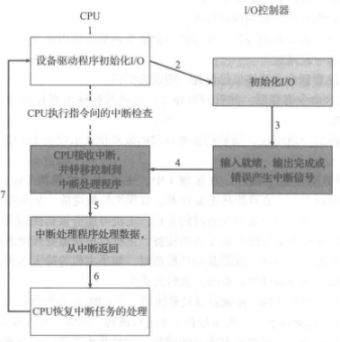

- CPU 和 **中断控制器（interrupt-controller）** 硬件提供了以下三个特性：
  - 在 CPU 执行关键指令时可以延迟对中断的处理
  - 能够将中断快速转发给适当的中断处理程序，而不必检查所有设备以确定是哪个设备引发了中断
  - 支持多级中断，可以根据紧迫性来响应中断

- 多数 CPU 有两个中断请求线： **非屏蔽中断（nonmaskable）** 用于处理非常严重的，不可以恢复的内存错误等问题， **可屏蔽中断（maskable）** 可被设备控制器用来请求服务，如果 CPU 正在执行关键、不可中断指令，则可以屏蔽这一类中断线上的请求。

- 中断机制根据 **中断向量（interrupt vector）** 来选择中断服务程序。中断向量和中断服务程序被维护在一张表中，中断向量支持的地址数量有限（例如 8 位中断向量只能对应 256 个中断服务程序，奔腾即为 256 个中断向量，0~31 用于各种错误等非屏蔽中断，剩下的为可屏蔽中断）， **中断链接（interrupt chaining）** 可解决这个问题：中断向量指向的不再是单一的中断服务程序，而是一个中断服务程序的链表，中断一旦发生，对应链表中的全部中断处理程序都会一一调用，直到发现了能够处理请求的中断服务程序为止。

- **中断优先级（interrupt priority）** 使 CPU 可以在不屏蔽所有中断的情况下延迟处理低优先级的中断，并且也允许高优先级的中断抢占低优先级的中断处理。

- 现代操作系统启动时会探查硬件总线、确定哪些设备存在并将对应的中断处理程序安装到中断向量中。操作系统对于中断机制的应用非常广泛：

  - 设备控制器通过中断表明自己已经准备好服务
  - 通过中断机制处理例如被 0 除、违例内存访问等 **异常（Exception）**
  - 使用中断进行虚拟内存分页，页错误会引发中断异常，这个中断会挂起当前进程并跳转到内核的页错误处理程序
  - 程序执行系统调用会触发 **软中断（software interrupt）** 或者 **陷阱指令（trap）**

#### 直接内存访问

- 使用通用处理器不断监听设备控制器的寄存器并按字节传输（ **程序控制 I/O** ，Programmed I/O，PIO）是对计算资源的非常过分的浪费。计算机为了避免 PIO 增加 CPU 负担，将一部分数据传输任务交付 **直接内存访问（direct-memory access，DMA）** 控制器。
- 开始 DMA 传输时，主机向内存写入 DMA 命令块，块中包含传输的源、目的地址指针以及传输的字节数。 **CPU 将该命令块的地址写到 DMA 控制器中** 并继续其他工作，DMA 控制器会根据命令块直接操作内存总线完成传输（这段时间 CPU 无法使用总线）。传输完成后 DMA 控制器会中断 CPU 并交还给 CPU 总线控制权。
- DMA 和设备控制器之间的握手通过 **DMA-request** 和 **DMA-acknowledge** 线进行，设备有数据需要传输时，设备控制器就通过 DMA-request 线通知 DMA 控制器，DMA 控制器会发出申请中断 CPU，在从 CPU 获取所需要的地址后将地址放到内存地址总线上，并通过 DMA-acknowledge 线通知设备控制器。设备控制器收到这个信号，向内存地址总线上的地址写入数据。交互过程如下图。
  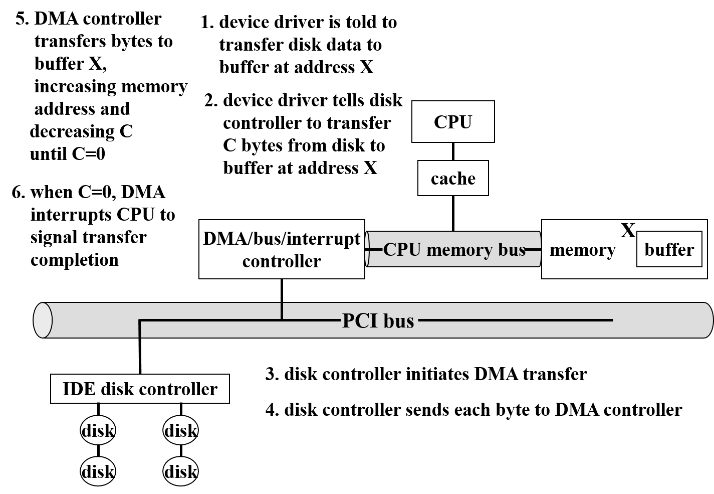
- DMA 控制总线传输期间 CPU 不能访问主存（仍可访问 L1、L2 缓存），这称为 **周期挪用（cycle stealing）** ，会放慢 CPU 计算，但往往能够改善系统总体性能。有的 DMA 使用物理内存地址，有的使用虚拟内存地址（这时候需要有一个虚拟到物理地址的转换），使用虚拟内存地址的 DMA 称为 **直接虚拟内存访问（direct virtual-memory access，DVMA）** 。DVMA 可以直接实现两个内存映射设备之间的传输而无需 CPU 干涉。

#### 通道
 - **通道(Channel)**也称为外围设备处理器、输入输出处理机，是相对于CPU而言的。是一个处理器。也能执行指令和由指令的程序，只不过通道执行的指令是与外部设备相关的指令。是一种实现主存与I/O设备进行直接数据交换的控制方式，与DMA控制方式相比，通道所需要的CPU控制更少，一个通道可以控制多个设备，并且能够一次进行多个不连续的数据块的存取交换，从而大大提高了计算机系统效率。

# I/O 应用接口及后面几节简单摘要

- 设备在很多方面有很大差异：

  - 字符流或块：字符流设备按字节传输，块设备以块为单位传输
  - 顺序访问或随机访问
  - 同步或异步：同步设备按照一定响应时间进行数据传输，异步设备则呈现无规则/不可预测的响应时间
  - 共享或专用：共享设备可以被多个进程/线程并发使用，专用设备则不可以
  - 操作速度：设备速度不同
  - 读写/只读/只写：设备支持的数据传输方向不同

- **块设备（block-device）** 接口规定了访问磁盘驱动器以及其它块设备所需的各个方面。操作系统本身和特殊的应用程序（如数据库）倾向于将块设备当作简单的线性块数组访问，这种访问方式称为 **原始（raw） I/O** 。

- **阻塞和非阻塞 I/O：**
  - 应用程序发出 **阻塞（blocking） I/O** 类型的系统调用时，应用程序就会被挂起，移动到进程等待队列中。因为阻塞式的 I/O 容易理解，并且 I/O 设备执行所需的时间是异步的，执行时间不可预估，因此绝大多数操作系统给应用程序预留的接口都是阻塞系统调用。
  - 有的用户级进程需要 **非阻塞（nonblocking） I/O** ，例如用户接口，它用来接收键盘/鼠标输入，同时还要在屏幕回显。又或者视频应用程序，它需要从磁盘读取帧并解码到显示器上。非阻塞 I/O 通常使用多线程实现，有的线程执行阻塞系统调用，其他线程继续执行。
  - **异步系统调用（asynchronous system call）** 不必等待 I/O 完成就可以立刻返回，应用程序继续执行。I/O 完成时会通知应用程序，比如设置程序空间里某个变量，或者触发信号/软件中断等。
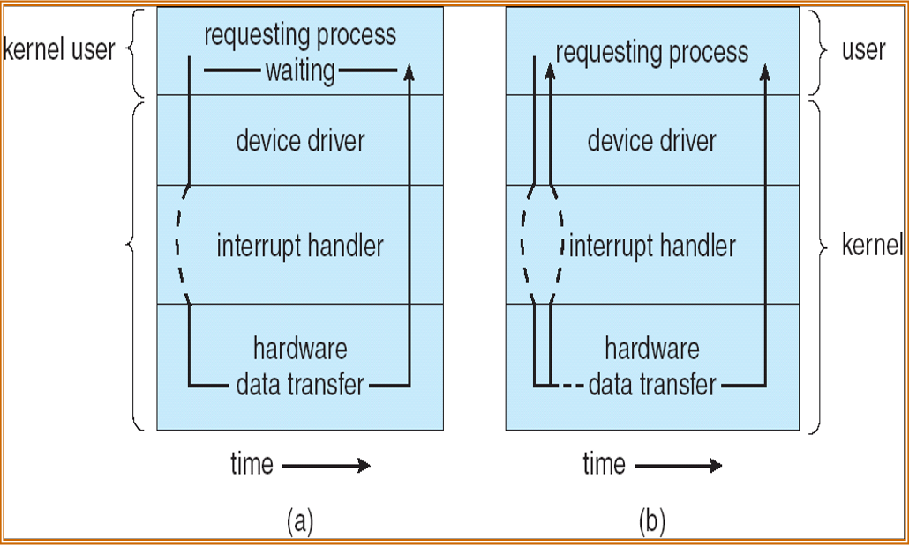

- **缓冲区（buffer）** 是用来保存两个设备之间或者设备和应用程序之间传输数据的内存区域。采用缓冲的理由有：

  - 处理数据流的生产者与消费者之间的速度差异
  - 协调传输数据大小不一致的设备
  - 支持程序 I/O 的复制语义

- **Spooling技术**
>假脱机系统； SPOOLing 技术实际上是一种外围设备同时联机操作技术,又称为排队转储技术。 
- 组成
  - 输入井和输出井:输入井和输出井的存储区域是在磁盘上开辟出来的。输入输出井中的数据一般以文件的形式组织管理，这些文件称之为井文件。一个文件仅存放某一个进程的输入或输出数据，所有进程的数据输入或输出文件链接成为一个输入输出队列。 
  - 输入缓冲区和输出缓冲区:输入缓冲区和输出缓冲区的存储区域是在内存中开辟出来的。主要用于缓和CPU和磁盘之间速度不匹配的矛盾。输入缓冲区用于暂存有输入设备传送的数据，之后再传送到输入井；输出缓冲区 同理。 
  - 输入进程和输出进程:输入进程也称为预输入进程，用于模拟脱机输入时的外围控制机，将用户要求的数据从输入设备传送到输入缓冲区，再存放到输入井。当CPU需要的时候，直接从输入井将数据读入内存。反之，输出的同理。 
  - 井管理程序:用于控制作业与磁盘井之间信息的交换。
- 特点
  - 提高了I/O的速度:,对数据执行的I/O操作，已从对低速I/O设备执行的I/O操作演变为对磁盘缓冲区中数据的存取，如同脱机输入输出一样，提高了I/O速度，缓和了CPU和低速的I/Os设备之间速度的不匹配的矛盾。 
  - 将独占设备改造成了共享设备:因为在假脱机打印机系统中，实际上并没有为任何进程分配设备，而只是在磁盘缓冲区中为进程分配了一个空闲盘块和建立了一张I/O请求表。 
  -	实现了虚拟设备功能:宏观上，对于每一个进程而言，它们认为是自己独占了一个设备，即使实际上是多个进程在同时使用一台独占设备。也可以说，假脱机系统，实现了将独占设备变换为若干台对应的逻辑设备的功能。

- **I/O 内核子系统**（kernel’s I/O subsystem）提供了很多和 I/O 有关的服务，包括：

  - 调度（scheduling）
  - 缓冲（buffering）
  - 高速缓存（caching）
  - 设备预留（device reservation）
  - 错误处理（error handling）
  - 名称转换（name translation）