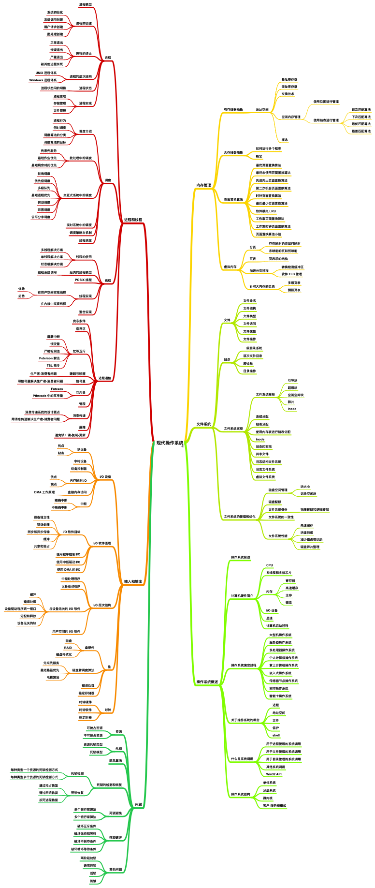

# 进程
## 进程状态

## 进程控制块PCB

<table border = "true" align = "center">
    <tr>
        <td>进程状态</td>
    </tr>
    <tr>
        <td>进程编号</td>
    </tr>
    <tr>
        <td>程序计数器</td>
    </tr>
    <tr>
        <td>寄存器</td>
    </tr>
    <tr>
        <td>内存界限</td>
    </tr>
    <tr>
        <td>打开文件列表</td>
    </tr>
    <tr>
        <td>...</td>
    </tr>
</table>

<ul>
<li>进程状态:状态包括new,ready,running,waiting,terminated等
<li>程序计数器:计数器表示进程要执行的下个指令地址
<li>CPU寄存器:
<li>CPU调度信息:进程优先级、调度队列的指针和其他调度参数
<li>内存管理信息:根据操作系统所使用的的内存系统，包括基址和界限寄存器的值、页表和段表
</ul>

## 进程生成

子进程，系统调用fork()的返回值为0，而对于父进程，返回值为子进程的标识符

### 僵尸进程和孤儿进程
<ul>
<li>一般情况下，子进程是由父进程创建，而子进程和父进程的退出是无顺序的，两者之间都不知道谁先退出。正常情况下父进程先结束会调用 wait 或者 waitpid 函数等待子进程完成再退出，而一旦父进程不等待直接退出，则剩下的子进程会被init(pid=1)进程接收，成会孤儿进程。（进程树中除了init都会有父进程）。
<li>如果子进程先退出了，父进程还未结束并且没有调用 wait 或者 waitpid 函数获取子进程的状态信息，则子进程残留的状态信息（ task_struct 结构和少量资源信息）会变成僵尸进程。
子进程退出时向父进程发送SIGCHILD信号，父进程处理SIGCHILD信号。在信号处理函数中调用wait进行处理僵尸进程。 
原理是将子进程成为孤儿进程，从而其的父进程变为init进程，通过init进程可以处理僵尸进程。
</ul>

### 守护进程是什么？怎么实现？
>守护进程（Daemon）是运行在后台的一种特殊进程。它独立于控制终端并且周期性地执行某种任务或等待处理某些发生的事件。守护进程是一种很有用的进程。

#### 守护进程特点
<ul>
<li>守护进程最重要的特性是后台运行。
<li>守护进程必须与其运行前的环境隔离开来。这些环境包括未关闭的文件描述符，控制终端，会话和进程组，工作目录以及文件创建掩模等。这些环境通常是守护进程从执行它的父进程（特别是shell）中继承下来的。 
<li>守护进程的启动方式有其特殊之处。它可以在Linux系统启动时从启动脚本/etc/rc.d中启动，可以由作业规划进程crond启动，还可以由用户终端（shell）执行。
</ul>

#### 实现
<ol>
<li>在父进程中执行fork并exit推出；
<li>在子进程中调用setsid函数创建新的会话；
<li>在子进程中调用chdir函数，让根目录 ”/” 成为子进程的工作目录；
<li>在子进程中调用umask函数，设置进程的umask为0；
<li>在子进程中关闭任何不需要的文件描述符
</ol>

## 进程通信
<ul>
<li>如果一个进程不能影响其他进程或被其他进程所影响，那么该进程是独立的
<li>如果一个进程能影响其他进程或被其他进程所影响，那么该进程是协作的
</ul>

协作进程需要一种进程间通信机制（interprocess communication，IPC）
### 进程间通信的基本模式
<ul>
<li>共享内存
<li>消息传递
</ul>

### 共享内存系统
>建立共享内存区域
#### 生产者-消费者问题

### 消息传递系统
<ul>
<li>直接或间接通信 
<ul>
<li>直接通信</li>
需要通信的每个进程必须明确地命名通信的接收者和发送者
<ul>
<li>send(P,message):发送消息到进程P
<li>receive(Q,message):接收来自进程Q的消息
</ul>
属性
<ul>
<li>在需要通信的每对进程之间自动建立线路
<li>一条线路只能与两个进程相关联
<li>每队进程之间只有一条线路
</ul>

缺点：限制进程定义的模块化，不利于维护（硬编码）
<li>间接通信</li>
通过邮箱或端口来发送接收消息
<ul>
<li>send(A,message):发送消息到邮箱A
<li>receive(A,message):接收来自邮箱A的消息
</ul>
属性
<ul>
<li>只有在两个进程共享一个邮箱时，才能建立通信线路
<li>一条线路可以与两个或更多的进程相关联
<li>两个通信进程之间可有多个不同的线路，每个线路对应一个邮箱
</ul>
</ul>
<li>同步或异步通信
<li>自动或显式缓冲
</ul>

### IPC系统实例

#### POSIX共享内存
<ol>
    <li>调用共享内存:</li>
    segment_id = shmget(IPC_PRIVATE,size,S_IRUSR|S_IWUSR) 
    第一个参数：共享内存关键字（标识符）。IPC_PRIVATE生成一个新的共享内存段 
    第二个参数：共享内存段的大小 
    第三个参数：模式是读或写 
    <li>访问共享内存:</li>
    shared_memory = (char*)shmat(id,NULL,0) 
    sprintf(shared_memory,"Write to shared memory") 
    第一个参数：共享内存关键字（标识符） 
    第二个参数：内存中的指针位置。NULL，系统为用户选择位置 
    第三个参数：模式是读或写 
    <li>分离共享内存:</li>
    shmdt(shared_memory) 
    <li>删除共享内存:</li>
    shmctl(segment_id,IPC_RMID,NULL) 
</ol>

#### Mach
#### Windos

### 客户机-服务器系统通信

#### Socket
#### RPC
#### RMI

## 线程

### 优点
<ul>
    <li>响应度高
    <li>资源共享
    <li>节省资源
    <li>多处理器体系结构的利用
</ul>

### 模型
<ul>
<li>多对一模型
<li>一对一模型
<li>多对多模型
</ul>

### 设计一个线程池，内存池
<ul>
<li>为什么需要线程池</li>

大多数的网络服务器，包括Web服务器都具有一个特点，就是单位时间内必须处理数目巨大的连接请求，但是处理时间却是比较短的。在传统的多线程服务器模型中是这样实现的：一旦有个请求到达，就创建一个新的线程，由该线程执行任务，任务执行完毕之后，线程就退出。这就是”即时创建，即时销毁”的策略。尽管与创建进程相比，创建线程的时间已经大大的缩短，但是如果提交给线程的任务是执行时间较短，而且执行次数非常频繁，那么服务器就将处于一个不停的创建线程和销毁线程的状态。这笔开销是不可忽略的，尤其是线程执行的时间非常非常短的情况。
<li>线程池原理</li>
在应用程序启动之后，就马上创建一定数量的线程，放入空闲的队列中。这些线程都是处于阻塞状态，这些线程只占一点内存，不占用CPU。当任务到来后，线程池将选择一个空闲的线程，将任务传入此线程中运行。当所有的线程都处在处理任务的时候，线程池将自动创建一定的数量的新线程，用于处理更多的任务。执行任务完成之后线程并不退出，而是继续在线程池中等待下一次任务。当大部分线程处于阻塞状态时，线程池将自动销毁一部分的线程，回收系统资源。
<li>线程池的作用</li>
需要大量的线程来完成任务，且完成任务的时间比较短；对性能要求苛刻的应用；对性能要求苛刻的应用
<li>内存池的原理</li>
在软件开发中，有些对象使用非常频繁，那么我们可以预先在堆中实例化一些对象，我们把维护这些对象的结构叫“内存池”。在需要用的时候，直接从内存池中拿，而不用从新实例化，在要销毁的时候，不是直接free/delete，而是返还给内存池。把那些常用的对象存在内存池中，就不用频繁的分配/回收内存，可以相对减少内存碎片，更重要的是实例化这样的对象更快，回收也更快。当内存池中的对象不够用的时候就扩容。可以避免频繁内核和用户态交换数据
<li>内存池的优缺点</li>
内存池对象不是线程安全的，在多线程编程中，创建一个对象时必须加锁。

## CPU调度

### 调度准则
<ul>
<li>CPU使用率
<li>吞吐量
<li>周转时间
<li>等待时间
<li>响应时间
</ul>

### 调度算法
<ul>
<li>先来先服务
<li>最短作业优先
<li>优先级调度
<li>时间片轮转
<li>多级队列
</ul>

## 进程同步

### 临界区
>对共享内存进行访问的代码片段
#### 条件
<ul>
<li>互斥</li>
实现互斥的方式
<ul>
<li>屏蔽中断
<li>加锁
</ul>
Peterson算法
TSL指令
SCHG指令
<li>前进
<li>有限等待
</ul>

### 信号量
>wait() signal() (P/V)

<ul>
<li>计数
<li>二进制0/1 mutex
</ul>

### 管程
>类型或抽象数据类型，封装了私有数据类型及操作数据的公有方法 
确保一次只有一个进程在管程内活动

## 死锁
### 必要条件
<ul>
<li>互斥
<li>循环等待
<li>忙则等待
<li>不可抢占
</ul>

### 死锁预防
破坏四个必要条件

### 从死锁中恢复

<li>通过抢占进行恢复</li>
在某些情况下，可能会临时将某个资源从它的持有者转移到另一个进程。比如在不通知原进程的情况下，将某个资源从进程中强制取走给其他进程使用，使用完后又送回。这种恢复方式一般比较困难而且有些简单粗暴，并不可取。

<li>通过回滚进行恢复</li>
如果系统设计者和机器操作员知道有可能发生死锁，那么就可以定期检查流程。进程的检测点意味着进程的状态可以被写入到文件以便后面进行恢复。检测点不仅包含存储映像(memory image)，还包含资源状态(resource state)。一种更有效的解决方式是不要覆盖原有的检测点，而是每出现一个检测点都要把它写入到文件中，这样当进程执行时，就会有一系列的检查点文件被累积起来。

为了进行恢复，要从上一个较早的检查点上开始，这样所需要资源的进程会回滚到上一个时间点，在这个时间点上，死锁进程还没有获取所需要的资源，可以在此时对其进行资源分配。

<li>杀死进程恢复</li>
最简单有效的解决方案是直接杀死一个死锁进程。但是杀死一个进程可能照样行不通，这时候就需要杀死别的资源进行恢复。

另外一种方式是选择一个环外的进程作为牺牲品来释放进程资源。

### 死锁避免
#### 俺安全状态
>如果OS能按某个顺序为每个进程分配资源并能避免死锁，那么OS状态就是安全的

安全状态不是死锁状态，死锁状态是不安全状态

#### 银行家算法
<ol>
<li>如果Request<=Need,转到2；否则出错</li>
<li>如果Request<=Available,转到3；否则等待</li>
<li>分配资源</li>
Available = Available - Request 
Allocation = Allocation + Request 
Need = Need - Request 
</ol>

## 内存管理
